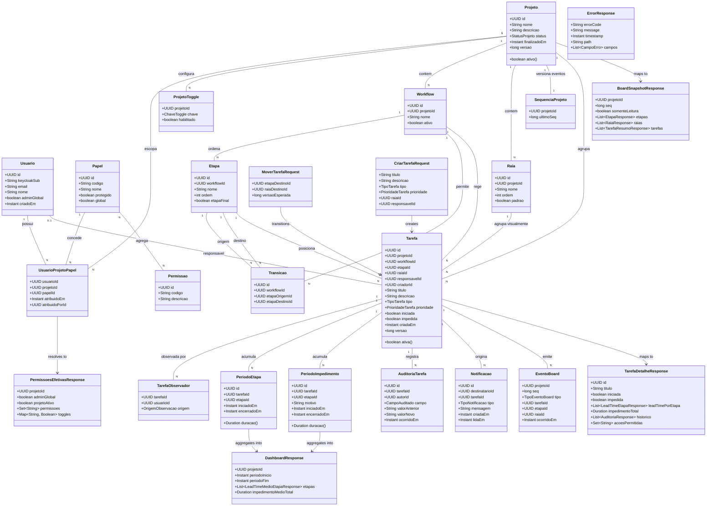

# Kanban de Tarefas Configurável — Board, Impedimentos, Lead-time e RBAC por Projeto

## Requirements

Implementar um sistema de kanban configurável por projeto que centralize o acompanhamento de trabalho de equipes de desenvolvimento, eliminando a dependência de reports manuais dispersos em email e chat.

O sistema deve:

- **Tornar o fluxo de trabalho explícito e verificável**: cada projeto define seu próprio workflow (etapas ordenadas e transições permitidas), e o sistema impede qualquer movimentação que viole esse grafo — independentemente do gesto de UI usado.
- **Tornar impedimentos visíveis no momento em que ocorrem**: qualquer membro autorizado sinaliza bloqueio no próprio card, e os interessados na tarefa recebem notificação interna sem depender de comunicação paralela.
- **Tornar o tempo mensurável**: registrar a permanência de cada tarefa em cada etapa e o tempo em que esteve impedida, expondo o detalhe por tarefa e a média agregada por etapa no dashboard de gestão.
- **Tornar o acesso governável por projeto**: papéis acumuláveis escopados ao par (usuário, projeto), modulados por um conjunto fechado de toggles, com toda autorização revalidada no backend.
- **Manter todos os participantes em estado convergente**: alterações no board propagam para os demais usuários conectados em até 2 segundos, com correção automática de divergência, operando corretamente de 1 a N instâncias.

**Valor**: reduzir o tempo de tarefas paradas por impedimento não percebido, e dar a gestores visibilidade de lead-time sem exigir participação na execução.

**Fronteiras**: single-tenant; notificações apenas internas (sem email/Slack); sem timesheet; sem dependência entre projetos; sem anexos, templates, duplicação ou importação em massa de cards; interface desktop-only (pt_BR).

**Decisões vinculantes herdadas** (não reabrir): Java 25 + Spring Boot 3.5.16 + PostgreSQL + Flyway (ADR-001/005); PostgreSQL como único armazenamento, sem cache/broker (ADR-002); RBAC híbrido com Keycloak autenticando e a aplicação autorizando (ADR-003); broadcast multi-pod via `LISTEN/NOTIFY` com `seq` e resync (ADR-004); sem fallback de autenticação local (ADR-006); bootstrap de admin global por e-mail configurado (ADR-007); backend e frontend containerizados (ADR-008); papéis acumuláveis por projeto a partir de catálogo fechado + toggles (BDR-001).

**Ambiguidades resolvidas nesta canvas** (registradas como premissas explícitas — ver `## Safeguards`, seção 10): A-1 a A-14 do documento de análise.

---

## Entities



**Enumerações**

- `StatusProjeto`: `ATIVO`, `FINALIZADO`
- `TipoTarefa`: `FEATURE`, `BUG`, `TAREFA`, `MELHORIA`
- `PrioridadeTarefa`: `BAIXA`, `MEDIA`, `ALTA`, `CRITICA`
- `OrigemObservacao`: `CRIADOR`, `RESPONSAVEL`, `EXPLICITO`
- `CampoAuditado`: `RESPONSAVEL`, `TITULO`, `ETAPA`, `IMPEDIMENTO`
- `TipoNotificacao`: `ETAPA_ALTERADA`, `IMPEDIMENTO_MARCADO`, `IMPEDIMENTO_DESMARCADO`
- `TipoEventoBoard`: `TAREFA_CRIADA`, `TAREFA_MOVIDA`, `TAREFA_ATUALIZADA`, `TAREFA_EXCLUIDA`, `TAREFA_IMPEDIDA`, `TAREFA_DESIMPEDIDA`, `BOARD_RECONFIGURADO`, `PROJETO_STATUS_ALTERADO`
- `ChaveToggle` (conjunto **fechado**, RF-016/BDR-001): `DEV_PODE_EXCLUIR_TAREFA`, `DEV_PODE_FINALIZAR_TAREFA`, `DEV_PODE_EDITAR_TAREFA_INICIADA`, `GESTOR_PODE_VER_BOARD`

**Catálogo fechado de permissões** (RF-013, BDR-001): `projeto:administrar`, `projeto:visualizar`, `workflow:gerenciar`, `raia:gerenciar`, `usuario:associar`, `tarefa:gerenciar`, `tarefa:mover`, `tarefa:finalizar`, `tarefa:impedir`, `tarefa:atribuir`, `dashboard:visualizar`.

**Catálogo fechado de papéis** (BDR-001): `admin` (global, protegido, RN-006), `project_admin`, `product_owner`, `dev`, `gestor`, `user` (legado, sem permissões, RN-014).

**Restrições conservadoras aplicadas**

- `Tarefa.impedida` permanece como flag booleana **derivada e denormalizada** (existência de `PeriodoImpedimento` aberto) para leitura barata do board — não é a fonte de verdade do cálculo.
- `AuditoriaTarefa` é log genérico chave-valor (`campo`, `valorAnterior`, `valorNovo`), **não** é a fonte do lead-time; os intervalos temporais vivem em `PeriodoEtapa`/`PeriodoImpedimento`.
- Raia é agrupamento visual puro: **não** possui transições, regras ou permissões próprias.
- Nenhum wrapper de entidade é criado para valores simples (motivo de impedimento é `String`, não value object).

---

## Approach

### 1. Modelagem de domínio e temporalidade

- **Grafo de workflow explícito**: etapas ordenadas (`ordem` é apenas apresentação e resolução do default de criação) e transições como arestas dirigidas independentes da ordem. Reordenar coluna **nunca** invalida transições.
- **Lead-time por intervalos persistidos, não por derivação de log**: toda entrada em etapa abre um `PeriodoEtapa`; toda saída o fecha. Toda marcação de impedimento abre um `PeriodoImpedimento` carimbado com a etapa vigente; desmarcar o fecha. Mover uma tarefa impedida **fecha e reabre** o período de impedimento na nova etapa — assim RN-002 consegue atribuir impedimento *por etapa* e *no total* sem ambiguidade.
- **Tempo carimbado sempre pelo banco** (`now()` transacional), nunca pelo relógio do pod — múltiplos pods têm relógios distintos e corromperiam médias de forma silenciosa (R-6).
- **Invariante verificável**: uma tarefa tem no máximo um `PeriodoEtapa` aberto e no máximo um `PeriodoImpedimento` aberto, garantido por índice único parcial (`WHERE encerrado_em IS NULL`).

### 2. Autorização (RNF-003, BDR-001, ADR-003/007)

- **Guard declarativo transversal** `@ExigePermissao(valor, escopo)` interceptado por aspecto, combinando três checagens em ordem fixa:
  1. **Permissão efetiva** = união das permissões dos papéis do usuário **naquele projeto**, com bypass incondicional para `Usuario.adminGlobal`;
  2. **Toggle do projeto**, quando a permissão declarar dependência de toggle (ex.: exclusão por `dev` exige `DEV_PODE_EXCLUIR_TAREFA`);
  3. **Projeto ativo**, para toda operação de escrita — **sem bypass algum**, inclusive admin global (RN-015).
- **O `projetoId` é sempre derivado do recurso** (tarefa → projeto), nunca aceito do cliente — aceitar do cliente é exatamente o vetor de escalonamento entre projetos que RNF-003 proíbe.
- **Teste de arquitetura obrigatório**: todo handler de escrita (`@PostMapping`/`@PutMapping`/`@PatchMapping`/`@DeleteMapping`) sem `@ExigePermissao` falha o build.
- **Endpoint de permissões efetivas** (`GET /api/projetos/{id}/permissoes`) alimenta a UI condicional — a UI é conveniência, o backend é autoridade.

### 3. Tempo real e convergência (ADR-002/004, RNF-001/RNF-002)

- **Porta de domínio** `EventoBoardPublisher` isolando a Service da infraestrutura de eventos; adapter `ListenNotifyEventoBoardPublisher` executa `NOTIFY board_events, '<json>'`.
- **Publicação sempre em `TransactionSynchronization.afterCommit`** — nunca dentro da transação, evitando notificar mudança que sofre rollback tardio.
- **`seq` monotônico por projeto**, incrementado via `UPDATE ... RETURNING` em `SequenciaProjeto` dentro da transação de escrita, embarcado no payload.
- **Payload enxuto** (ids + tipo + `seq`, ≤ 8KB): o cliente busca detalhe via REST. Operações em lote (reconfiguração de board) emitem um único evento `BOARD_RECONFIGURADO` em vez de N eventos.
- **Resync client-side**: o frontend guarda o último `seq` por board; gap (`seq > ultimo + 1`), reconexão do WebSocket ou retorno de foco da aba disparam `GET /api/projetos/{id}/board` — cobre inclusive a perda do *último* evento, que não gera gap detectável.
- **Notificação por usuário em multi-pod**: o mesmo canal `board_events` transporta os destinatários no payload; cada pod filtra e entrega apenas às sessões STOMP que ele mesmo hospeda. Sem broker relay (proibido por ADR-002).
- **Resiliência do listener**: reconexão JDBC com backoff exponencial; readiness do Actuator reflete o estado da conexão; log `WARN` progressivo até `ERROR` no esgotamento.

### 4. Concorrência e integridade

- **Bloqueio otimista** (`@Version`) em `Tarefa` e `Projeto`. `MoverTarefaRequest.versaoEsperada` é obrigatório: dois usuários arrastando o mesmo card resultam em `ConflitoConcorrenciaException` para o segundo, e a UI devolve o card à posição original (fluxo já previsto no design brief §5).
- **Transição validada contra a etapa de origem relida dentro da transação**, não contra a etapa que o cliente acredita ser a atual.
- **Escrita, auditoria, intervalos e incremento de `seq` na mesma transação**; apenas a publicação do evento sai dela (`afterCommit`).
- **Integridade de configuração (RN-005)** garantida em duas camadas: validação de serviço com mensagem de negócio, e FK `ON DELETE RESTRICT` como rede de segurança.

### 5. Cálculo de lead-time e dashboard

- **Detalhe da tarefa (RF-006)**: soma dos `PeriodoEtapa` por etapa + soma dos `PeriodoImpedimento` por etapa e total; intervalo aberto é computado até `now()`.
- **Dashboard (RF-007)**: agregação **sob demanda** com filtro de período obrigatório (default: últimos 30 dias), via query agregada indexada por `(projeto_id, etapa_id, iniciado_em)`. Materialização assíncrona fica como evolução condicionada a volume medido — ADR-002 impõe simplicidade nesta fase e não há meta numérica de performance para o dashboard (RNF-001 cobre apenas o board). A UI usa skeleton (DDR-003), que acomoda ambas as implementações sem retrabalho visual.
- **Relógios não pausam** durante projeto finalizado: finalizar bloqueia escrita, não interrompe a contagem. Intervalos abertos são computados até `now()` de forma uniforme.

### 6. Autenticação e provisionamento (ADR-003/006/007)

- **Resource server OIDC** validando o JWT do Keycloak; **sem fallback local** — Keycloak indisponível ⇒ login falha com erro explícito.
- **Provisionamento JIT**: primeiro acesso cria `Usuario` a partir das claims (`sub`, `email`, `name`), atribuindo o papel legado `user`.
- **Bootstrap de admin**: se o e-mail bate com `kanban.bootstrap.admin-email`, marca `adminGlobal=true` uma única vez (nunca reaplicado, nunca exposto em endpoint de escrita).

### 7. Tratamento de erros

- **`GlobalExceptionHandler`** (`@RestControllerAdvice`) traduz toda exceção em `ErrorResponse` uniforme (`errorCode`, `message`, `timestamp`, `path`, `campos`).
- **Hierarquia**: `BusinessException` (base, carrega `errorCode` + HTTP status) → exceções específicas por domínio. Exceções nunca vazam stack trace, SQL, nome de tabela ou identificador interno de infraestrutura.
- **Códigos de erro estáveis e semânticos** (`TRANSICAO_NAO_PERMITIDA`, `PROJETO_FINALIZADO`, …), consumidos pelo frontend para escolher entre toast e modal (DDR-003).

### 8. Frontend (Next.js)

- **11 telas do screen map** com os seis estados obrigatórios (idle/loading/preenchido/erro/sucesso/vazio).
- **Duas formas de mover** (drag-and-drop e menu do card, DDR-002) chamando **o mesmo** endpoint `PATCH /api/tarefas/{id}/mover` — validação única.
- **Destaque de destinos válidos durante o drag**: apenas **colunas** com transição configurada a partir da etapa atual **e** para as quais o usuário tem permissão (incluindo `tarefa:finalizar` quando o destino é a etapa final); raias nunca são restringidas.
- **Cliente STOMP** inscrito em `/topic/board/{projetoId}` e `/topic/notificacoes/{usuarioId}`, com máquina de resync por `seq`.

---

## Structure

### Inheritance Relationships

1. `BusinessException` extends `RuntimeException` — base de todas as exceções de negócio, carrega `errorCode` e `httpStatus`.
2. `TransicaoNaoPermitidaException`, `ProjetoFinalizadoException`, `PermissaoNegadaException`, `TarefaIniciadaException`, `RecursoEmUsoException`, `ConflitoConcorrenciaException`, `ConfiguracaoWorkflowInvalidaException`, `RecursoNaoEncontradoException` extend `BusinessException`.
3. `EventoBoardPublisher` interface define a porta de publicação de eventos de board; `ListenNotifyEventoBoardPublisher` implements `EventoBoardPublisher`.
4. `BoardEventListener` interface define o consumo de eventos recebidos; `StompBoardEventListener` implements `BoardEventListener`.
5. `AuditavelListener` (Hibernate entity listener) preenche campos de criação/alteração em entidades que implementam `Auditavel`.
6. Todos os repositórios extend `JpaRepository<T, UUID>`; `TarefaRepositoryCustom` + `TarefaRepositoryImpl` para queries agregadas de dashboard.
7. `GlobalExceptionHandler` anotada com `@RestControllerAdvice`.

### Dependencies

1. `TarefaController` injects `TarefaService`, `TarefaMapper`.
2. `BoardController` injects `BoardQueryService`, `BoardMapper`.
3. `ProjetoController` injects `ProjetoService`, `PermissaoQueryService`, `ProjetoMapper`.
4. `WorkflowController` injects `WorkflowService`, `EtapaService`, `TransicaoService`.
5. `RaiaController` injects `RaiaService`.
6. `AdminPapelController` injects `UsuarioProjetoPapelService`, `ProjetoToggleService`.
7. `DashboardController` injects `DashboardService`.
8. `NotificacaoController` injects `NotificacaoService`.
9. `TarefaService` depends on `TarefaRepository`, `EtapaRepository`, `TransicaoRepository`, `RaiaRepository`, `LeadTimeService`, `AuditoriaService`, `NotificacaoService`, `EventoBoardPublisher`, `PermissaoGuard`.
10. `LeadTimeService` depends on `PeriodoEtapaRepository`, `PeriodoImpedimentoRepository`, `ClockProvider`.
11. `DashboardService` depends on `TarefaRepositoryCustom`, `EtapaRepository`, `PermissaoGuard`.
12. `PermissaoGuard` depends on `PermissaoService`, `ProjetoRepository`, `ProjetoToggleService`, `UsuarioAtualProvider`.
13. `PermissaoService` depends on `UsuarioProjetoPapelRepository`, `PapelRepository`.
14. `NotificacaoService` depends on `NotificacaoRepository`, `TarefaObservadorRepository`, `EventoBoardPublisher`.
15. `ListenNotifyEventoBoardPublisher` depends on `SequenciaProjetoRepository`, `DataSource`, `ObjectMapper`, `TransactionSynchronizationManager`.
16. `BoardEventLoop` (componente de ciclo de vida) depends on `DataSource`, `StompBoardEventListener`, `MeterRegistry`.
17. `StompBoardEventListener` depends on `SimpMessagingTemplate`, `SimpUserRegistry`.
18. `UsuarioProvisioningService` depends on `UsuarioRepository`, `PapelRepository`, `@Value kanban.bootstrap.admin-email`.
19. `PermissaoAspect` depends on `PermissaoGuard`; intercepta `@ExigePermissao`.
20. Todos os mappers são interfaces MapStruct (`componentModel = "spring"`), sem mapeamento manual.

### Layered Architecture

1. **Controller Layer**: expõe REST sob `/api/**` e handlers STOMP; valida payload com Bean Validation; **não** contém regra de negócio; declara `@ExigePermissao` em toda escrita.
2. **Service Layer**: detém todas as regras (transição, trava pós-início, toggles, RN-005, RN-015, RN-CB-*), define fronteira transacional com `@Transactional`, orquestra auditoria + intervalos + evento.
3. **Repository Layer**: Spring Data JPA; queries derivadas e `@Query` para agregações; `TarefaRepositoryImpl` para o agregado de dashboard.
4. **Data Access / Schema Layer**: PostgreSQL com schema versionado por Flyway (`V{n}__{descricao}.sql`); `ddl-auto=validate`; índices únicos parciais para os invariantes de intervalo aberto.
5. **Realtime Layer**: porta `EventoBoardPublisher` + adapter `LISTEN/NOTIFY` + `BoardEventLoop` + broker STOMP simples in-memory por pod.
6. **Security Layer**: `SecurityConfig` (resource server OIDC), `UsuarioProvisioningService` (JIT), `PermissaoGuard` + `PermissaoAspect`.
7. **Exception Handling Layer**: `GlobalExceptionHandler` centraliza a tradução para `ErrorResponse`.
8. **Frontend Layer** (Next.js): `app/` (rotas do screen map), `components/` (Board, Card, Drawer, Modal, Toast, Skeleton), `hooks/` (`useBoardStream`, `usePermissoes`), `lib/api` (cliente REST tipado), `lib/stomp` (cliente STOMP com resync por `seq`), `styles/tokens.css` (gerado de `design-tokens.json`).

### Package Layout (backend)

```
br.com.crudao.kanban
├── config          SecurityConfig, WebSocketConfig, JacksonConfig, FlywayConfig
├── security        PermissaoGuard, PermissaoAspect, ExigePermissao, UsuarioAtualProvider,
│                   UsuarioProvisioningService
├── projeto         Projeto, ProjetoToggle, ProjetoService, ProjetoToggleService,
│                   ProjetoController, ProjetoRepository, ProjetoMapper
├── workflow        Workflow, Etapa, Transicao, WorkflowService, EtapaService,
│                   TransicaoService, WorkflowController, *Repository, *Mapper
├── raia            Raia, RaiaService, RaiaController, RaiaRepository, RaiaMapper
├── tarefa          Tarefa, TarefaObservador, TarefaService, TarefaController,
│                   TarefaRepository, TarefaMapper
├── board           BoardQueryService, BoardController, BoardSnapshotResponse, BoardMapper
├── leadtime        PeriodoEtapa, PeriodoImpedimento, LeadTimeService, DashboardService,
│                   DashboardController, *Repository
├── auditoria       AuditoriaTarefa, AuditoriaService, AuditoriaRepository
├── notificacao     Notificacao, NotificacaoService, NotificacaoController, NotificacaoRepository
├── evento          EventoBoard, EventoBoardPublisher, ListenNotifyEventoBoardPublisher,
│                   BoardEventLoop, StompBoardEventListener, SequenciaProjeto*
├── rbac            Usuario, Papel, Permissao, UsuarioProjetoPapel, PermissaoService,
│                   UsuarioProjetoPapelService, AdminPapelController, *Repository
└── common          BusinessException + subclasses, GlobalExceptionHandler, ErrorResponse,
                    ClockProvider, Auditavel
```

---

## Operations

> Ordem de execução respeitando dependências. Cada bloco é uma unidade entregável e verificável.

### 1. Create Migrations - Flyway Baseline

1. **Responsabilidade**: versionar todo o schema; `ddl-auto=validate` (ADR-005).
2. **Scripts**:
   - `V1__usuario_papel_permissao.sql`: `usuario` (`id`, `keycloak_sub` UNIQUE, `email` UNIQUE, `nome`, `admin_global` BOOLEAN NOT NULL DEFAULT false, `criado_em`), `papel` (`codigo` UNIQUE, `protegido`, `global`), `permissao` (`codigo` UNIQUE), `papel_permissao` (PK composta). Seed do catálogo fechado de papéis e permissões e do mapeamento default (ver bloco 2).
   - `V2__projeto.sql`: `projeto` (`status` VARCHAR CHECK IN ('ATIVO','FINALIZADO'), `finalizado_em`, `versao` BIGINT NOT NULL DEFAULT 0), `projeto_toggle` (PK `(projeto_id, chave)`, `habilitado` NOT NULL).
   - `V3__usuario_projeto_papel.sql`: PK composta `(usuario_id, projeto_id, papel_id)`, FKs `ON DELETE CASCADE` para usuário/projeto e `RESTRICT` para papel.
   - `V4__workflow_etapa_transicao.sql`: `workflow` (`projeto_id`, `ativo`), índice único parcial `UNIQUE (projeto_id) WHERE ativo` — garante exatamente um workflow ativo por projeto; `etapa` (`ordem`, `etapa_final`, UNIQUE `(workflow_id, ordem)`, índice único parcial `UNIQUE (workflow_id) WHERE etapa_final`); `transicao` (UNIQUE `(workflow_id, etapa_origem_id, etapa_destino_id)`, CHECK `etapa_origem_id <> etapa_destino_id`).
   - `V5__raia.sql`: `raia` (`projeto_id`, `ordem`, `padrao`), índice único parcial `UNIQUE (projeto_id) WHERE padrao`.
   - `V6__tarefa.sql`: `tarefa` com FKs `RESTRICT` para `etapa`, `raia`, `workflow`; `responsavel_id` NULLABLE; `iniciada`, `impedida` BOOLEAN NOT NULL DEFAULT false; `versao` BIGINT; índices `(projeto_id, etapa_id)` e `(projeto_id, raia_id)`. `tarefa_observador` PK `(tarefa_id, usuario_id)`.
   - `V7__periodos_leadtime.sql`: `periodo_etapa` e `periodo_impedimento` (`iniciado_em` NOT NULL DEFAULT now(), `encerrado_em` NULLABLE, CHECK `encerrado_em IS NULL OR encerrado_em >= iniciado_em`); índices únicos parciais `UNIQUE (tarefa_id) WHERE encerrado_em IS NULL` em **ambas**; índices `(projeto_id, etapa_id, iniciado_em)` para o dashboard.
   - `V8__auditoria_notificacao.sql`: `auditoria_tarefa` (append-only, sem UPDATE/DELETE), `notificacao` (`destinatario_id`, `lida_em` NULLABLE, índice `(destinatario_id, lida_em)`).
   - `V9__sequencia_projeto.sql`: `sequencia_projeto` (`projeto_id` PK, `ultimo_seq` BIGINT NOT NULL DEFAULT 0).
3. **Constraints**: todo timestamp é `TIMESTAMPTZ` com default `now()`; nenhuma coluna de tempo é preenchida pela aplicação.

### 2. Seed Catálogo RBAC (dentro de V1)

1. **Papéis**: `admin` (`protegido=true`, `global=true`), `project_admin`, `product_owner`, `dev`, `gestor`, `user` (sem permissões, RN-014).
2. **Mapeamento default papel → permissões**:
   - `project_admin`: todas exceto criação/edição de papéis e permissões (exclusivo do admin global, BDR-001).
   - `product_owner`: `projeto:visualizar`, `tarefa:gerenciar`, `tarefa:mover`, `tarefa:finalizar`, `tarefa:impedir`, `tarefa:atribuir`, `dashboard:visualizar`.
   - `dev`: `projeto:visualizar`, `tarefa:gerenciar`, `tarefa:mover`, `tarefa:impedir`, `dashboard:visualizar`. **Não** recebe `tarefa:finalizar` por default (RN-011).
   - `gestor`: `projeto:visualizar`, `dashboard:visualizar`. **Não** recebe `tarefa:impedir` (RN-013).
   - `user`: nenhuma.
3. **Toggles default por projeto** (criados junto do projeto): `DEV_PODE_EXCLUIR_TAREFA=true`, `DEV_PODE_FINALIZAR_TAREFA=false`, `DEV_PODE_EDITAR_TAREFA_INICIADA=false`, `GESTOR_PODE_VER_BOARD=true`.

### 3. Create Exception Hierarchy - `common`

1. **`BusinessException` extends RuntimeException**
   - Atributos: `errorCode: String`, `httpStatus: HttpStatus`, `campos: List<CampoErro>`.
   - Construtores: `(errorCode, message)`, `(errorCode, message, httpStatus)`, `(errorCode, message, campos)`.
2. **Subclasses e códigos**:
   | Exceção | errorCode | HTTP |
   |---|---|---|
   | `RecursoNaoEncontradoException` | `RECURSO_NAO_ENCONTRADO` | 404 |
   | `PermissaoNegadaException` | `PERMISSAO_NEGADA` | 403 |
   | `ProjetoFinalizadoException` | `PROJETO_FINALIZADO` | 409 |
   | `TransicaoNaoPermitidaException` | `TRANSICAO_NAO_PERMITIDA` | 422 |
   | `TarefaIniciadaException` | `TAREFA_INICIADA_CAMPO_BLOQUEADO` | 422 |
   | `RecursoEmUsoException` | `RECURSO_POSSUI_TAREFAS_ATIVAS` | 409 |
   | `ConfiguracaoWorkflowInvalidaException` | `WORKFLOW_INVALIDO` | 422 |
   | `ConflitoConcorrenciaException` | `CONFLITO_CONCORRENCIA` | 409 |
3. **Uso**: lançadas exclusivamente pela Service Layer; Controller nunca lança regra de negócio.

### 4. Create Exception Handler - `GlobalExceptionHandler`

1. **Responsabilidade**: tradução única de exceção → `ErrorResponse`.
2. **Métodos**:
   - `handleBusinessException(BusinessException, HttpServletRequest): ResponseEntity<ErrorResponse>` — usa `errorCode`/`httpStatus` da exceção; log `WARN`.
   - `handleValidationException(MethodArgumentNotValidException, HttpServletRequest): ResponseEntity<ErrorResponse>` — `errorCode=VALIDACAO_ENTRADA`, 400, popula `campos` com `field`/`mensagem`; log `WARN`.
   - `handleOptimisticLock(ObjectOptimisticLockingFailureException, …)` — traduz para `CONFLITO_CONCORRENCIA`, 409.
   - `handleDataIntegrity(DataIntegrityViolationException, …)` — `errorCode=VIOLACAO_INTEGRIDADE`, 409, mensagem genérica **sem** nome de constraint/tabela.
   - `handleAccessDenied(AccessDeniedException, …)` — `PERMISSAO_NEGADA`, 403.
   - `handleGeneric(Exception, …)` — `errorCode=ERRO_INTERNO`, 500, mensagem fixa; log `ERROR` com stack trace e correlation id, **nunca** devolvido ao cliente.
3. **Anotações**: `@RestControllerAdvice`, `@ExceptionHandler`, `@Slf4j`.

### 5. Create Security - `SecurityConfig`, `UsuarioProvisioningService`, `PermissaoGuard`

1. **`SecurityConfig`**
   - `SecurityFilterChain`: OAuth2 resource server (JWT), `/api/**` autenticado, `/actuator/health/**` liberado, CSRF desabilitado (API stateless), sessão `STATELESS`, endpoint `/ws` autenticado.
   - **CORS**: `CorsConfigurationSource` aplicado a `/api/**` e `/ws/**`, com as origens permitidas vindas de `kanban.cors.origens-permitidas` (lista, default `http://localhost:3000`) — **nunca** `*`. Métodos `GET/POST/PUT/PATCH/DELETE/OPTIONS`, header `Authorization` permitido, `allowCredentials=false` (o token viaja no header, não em cookie). Sem isto o frontend em `:3000` não alcança o backend em `:8081` no navegador.
   - **Nota crítica de teste (achado `testing.md`)**: isolar a resolução do issuer para permitir slice tests sem Keycloak em pé — usar `spring.security.oauth2.resourceserver.jwt.issuer-uri` com `JwtDecoder` stub em perfil `test`.
2. **`UsuarioProvisioningService`**
   - `provisionar(Jwt): Usuario`
     - Busca por `keycloakSub`; se ausente, cria com `email`/`nome` das claims e papel `user`.
     - Se `email` == `kanban.bootstrap.admin-email` **e** `adminGlobal == false`, seta `adminGlobal=true` uma única vez (ADR-007).
     - `@Transactional`.
3. **`PermissaoGuard`**
   - `exigir(String permissao, UUID projetoId): void` — resolve usuário atual; se `adminGlobal`, retorna; senão verifica permissão efetiva; lança `PermissaoNegadaException`.
   - `exigirToggle(ChaveToggle chave, UUID projetoId, String papelCondicionante): void` — se o usuário só possui o papel condicionante (ex.: `dev`) e o toggle está desabilitado, lança `PermissaoNegadaException`.
   - `exigirProjetoAtivo(UUID projetoId): void` — **sem bypass de admin global** (RN-015); lança `ProjetoFinalizadoException`.
   - `membro(UUID projetoId): boolean`.
   - `permissoesEfetivas(UUID projetoId): Set<String>`.
4. **`@ExigePermissao`** — anotação `@Target(METHOD)`, atributos `valor`, `escopoProjeto` (SpEL para extrair o recurso), `escrita` (default `true`, aciona `exigirProjetoAtivo`).
5. **`PermissaoAspect`** — `@Around`, resolve `projetoId` **a partir do recurso** (nunca de parâmetro do cliente), aplica as três checagens na ordem: permissão → toggle → projeto ativo.

### 6. Implement Service - `ProjetoService`

1. **Interface**: `criar`, `atualizar`, `finalizar`, `reabrir`, `listarDoUsuario`, `buscar`.
2. **Métodos**:
   - `criar(CriarProjetoRequest, Usuario autor): Projeto`
     - Validação: nome obrigatório e único; exige `adminGlobal` **ou** `projeto:administrar` (checado diretamente no service, pois não há projeto para escopar — ADR-007).
     - Lógica: persiste projeto `ATIVO`; cria `SequenciaProjeto(ultimoSeq=0)`; cria os 4 `ProjetoToggle` com defaults; cria a **raia padrão "Geral"** (`padrao=true`) — resolve o conceito de "raia default" de RN-CB-005 sem introduzir entidade global; associa o autor como `project_admin`.
     - Retorno: projeto criado.
   - `finalizar(UUID id): Projeto` — exige `projeto:administrar`; idempotente se já finalizado; seta `status=FINALIZADO`, `finalizadoEm=now()`; emite `PROJETO_STATUS_ALTERADO`. **Não** encerra períodos abertos (relógios seguem correndo).
   - `reabrir(UUID id): Projeto` — exige `projeto:administrar`; volta a `ATIVO`, limpa `finalizadoEm`; emite evento.
   - `excluir(UUID id)` — exige `projeto:administrar`; bloqueia com `RecursoEmUsoException` se houver **qualquer** tarefa ativa (RN-005).
3. **Transação**: `@Transactional` em toda escrita; publicação de evento em `afterCommit`.

### 7. Implement Service - `WorkflowService` / `EtapaService` / `TransicaoService`

1. **`WorkflowService`**
   - `criar(UUID projetoId, CriarWorkflowRequest): Workflow` — primeiro workflow do projeto nasce `ativo=true`; demais nascem inativos.
   - `ativar(UUID workflowId)` — desativa o anterior e ativa o novo na mesma transação; **bloqueia** se houver tarefas ativas no workflow corrente (evita órfãos de etapa).
   - `excluir(UUID workflowId)` — `RecursoEmUsoException` se houver tarefa ativa vinculada (RN-005, RF-009).
2. **`EtapaService`**
   - `criar(UUID workflowId, CriarEtapaRequest): Etapa` — `ordem` = max+1; no máximo uma etapa com `etapaFinal=true`.
   - `reordenar(UUID workflowId, List<UUID> ordemIds): void` — reescreve `ordem` na sequência informada; **não** toca em transições (ordem é apresentação, o grafo é independente).
   - `excluir(UUID etapaId)` — bloqueia se houver tarefa ativa na etapa (RN-005); remove transições incidentes; revalida RN-003 nas etapas afetadas.
   - `validarWorkflow(UUID workflowId): void` — **invariante RN-003**: toda etapa não-final possui ≥ 1 transição de saída; a etapa final existe e é única; nenhuma etapa é inalcançável a partir da etapa de menor ordem. Lança `ConfiguracaoWorkflowInvalidaException`. Chamado ao final de toda mutação de workflow/etapa/transição.
3. **`TransicaoService`**
   - `criar(UUID workflowId, UUID origemId, UUID destinoId): Transicao` — rejeita self-loop e duplicata; rejeita origem = etapa final (RN-004: etapa final não tem saída padrão; o retorno é a operação de desfinalizar).
   - `excluir(UUID id)` — revalida RN-003 após remoção.
   - `destinosPermitidos(UUID etapaOrigemId): List<Etapa>`.

### 8. Implement Service - `RaiaService`

1. `criar(UUID projetoId, CriarRaiaRequest): Raia` — `ordem` = max+1; a primeira raia do projeto é `padrao=true`.
2. `definirPadrao(UUID raiaId)` — move a flag; garante exatamente uma padrão por projeto.
3. `excluir(UUID raiaId)` — bloqueia se houver tarefa ativa na raia (RN-005) e se for a raia padrão e houver outras tarefas; a raia padrão só é removível se for a única e o projeto não tiver tarefas.
4. **Constraint**: raia **não** possui transições nem permissões — é agrupamento visual (design brief §5).

### 9. Implement Service - `TarefaService` (núcleo)

1. **Dependências**: `TarefaRepository`, `EtapaRepository`, `TransicaoRepository`, `RaiaRepository`, `LeadTimeService`, `AuditoriaService`, `NotificacaoService`, `EventoBoardPublisher`, `PermissaoGuard`.
2. **`criar(UUID projetoId, CriarTarefaRequest, Usuario autor): Tarefa`** — RF-018, RN-CB-001/003/004/005
   - Validação de entrada: `titulo` obrigatório (1..200), `descricao` ≤ 4000, `tipo` obrigatório, `prioridade` default `MEDIA`.
   - Guard: `tarefa:gerenciar` + projeto ativo.
   - Lógica:
     - resolve o workflow ativo do projeto; se inexistente ou sem etapas → `ConfiguracaoWorkflowInvalidaException`;
     - etapa = a de **menor `ordem`**; raia = a informada, senão a `padrao` do projeto;
     - `responsavelId` = o informado (exige `tarefa:atribuir` se ≠ do próprio usuário) ou **null** (RN-CB-004);
     - `iniciada=false`, `impedida=false`;
     - abre `PeriodoEtapa` na etapa inicial;
     - registra observador `CRIADOR` (e `RESPONSAVEL` se houver);
     - auditoria não é gerada na criação (RN-016 cobre alterações).
   - Evento: `TAREFA_CRIADA` em `afterCommit`.
3. **`mover(UUID tarefaId, MoverTarefaRequest, Usuario autor): Tarefa`** — RF-002, RF-012, RN-001/002/004/011
   - Guard: `tarefa:mover` + projeto ativo; se `etapaDestino.etapaFinal` **ou** `etapaAtual.etapaFinal` (desfinalizar), exige adicionalmente `tarefa:finalizar` (RN-011), com o toggle `DEV_PODE_FINALIZAR_TAREFA` liberando o papel `dev`.
   - Lógica:
     - relê a tarefa com `versao`; se `versaoEsperada` diverge → `ConflitoConcorrenciaException`;
     - **caso desfinalizar** (`etapaAtual.etapaFinal == true`): destino válido = qualquer etapa **predecessora direta** da etapa final no grafo (`Transicao.destino == etapaFinal`); fora disso → `TransicaoNaoPermitidaException`. Isso impede que o retorno contorne o grafo;
     - **caso normal**: exige `Transicao(origem=etapaAtual, destino=etapaDestino)`; ausente → `TransicaoNaoPermitidaException` com o nome das etapas na mensagem;
     - `LeadTimeService.encerrarPeriodoEtapa(tarefa)` + `abrirPeriodoEtapa(tarefa, etapaDestino)`;
     - se `tarefa.impedida`, `LeadTimeService.reancorarImpedimento(tarefa, etapaDestino)` — fecha o período na etapa antiga e abre um novo na nova (atribuição correta de RN-002 por etapa);
     - se a etapa de origem era a de menor ordem, seta `iniciada=true` (**sticky** — voltar não desfaz);
     - `raiaId` atualizado se informado (movimento entre raias é livre, sem regra de transição);
     - auditoria `ETAPA` (valor anterior/novo = nome da etapa);
     - notifica observadores (`ETAPA_ALTERADA`).
   - Evento: `TAREFA_MOVIDA`.
4. **`atualizar(UUID tarefaId, AtualizarTarefaRequest, Usuario autor): Tarefa`** — RF-003
   - Guard: `tarefa:gerenciar` + projeto ativo.
   - Lógica: se `iniciada == true` e o usuário não tem `DEV_PODE_EDITAR_TAREFA_INICIADA` (ou papel administrativo), **bloqueia** alteração de `descricao` e `tipo` (campos estruturais) com `TarefaIniciadaException`. Permanecem editáveis: `titulo`, `prioridade`, `responsavel`, `raia`, `impedimento`, `etapa` — `titulo` é editável porque RN-016 exige auditá-lo, o que só faz sentido se ele puder mudar.
   - Auditoria: `TITULO` quando alterado.
   - Evento: `TAREFA_ATUALIZADA`.
5. **`atribuir(UUID tarefaId, UUID novoResponsavelId, Usuario autor): Tarefa`** — RN-012
   - Lógica: se `novoResponsavelId == autor.id`, basta `tarefa:mover` (autoatribuição livre, **mesmo já atribuída a outro**); caso contrário exige `tarefa:atribuir`. Registra observador `RESPONSAVEL` para o novo responsável; auditoria `RESPONSAVEL`; notifica observadores.
6. **`marcarImpedimento(UUID tarefaId, String motivo, Usuario autor): Tarefa`** / **`desmarcarImpedimento(...)`** — RF-004, RN-013
   - Guard: `tarefa:impedir` + projeto ativo.
   - Lógica: idempotente (marcar tarefa já impedida não abre segundo período); abre/fecha `PeriodoImpedimento` carimbado com a etapa atual; sincroniza a flag `impedida`; auditoria `IMPEDIMENTO`; notifica observadores.
   - **Regra explícita**: impedimento **não** bloqueia nem libera movimentação (DDR-002).
   - Eventos: `TAREFA_IMPEDIDA` / `TAREFA_DESIMPEDIDA`.
7. **`excluir(UUID tarefaId, Usuario autor): void`** — RF-019, RN-CB-001/002/003
   - Guard: `tarefa:gerenciar` + projeto ativo + toggle `DEV_PODE_EXCLUIR_TAREFA` quando o usuário for `dev` sem papel administrativo.
   - Lógica: fecha períodos abertos (etapa e impedimento) antes de excluir, para não contaminar médias com intervalo aberto órfão; remove observadores e notificações; **preserva** a auditoria (append-only).
   - Evento: `TAREFA_EXCLUIDA`.
8. **`observar(UUID tarefaId, Usuario) / desobservar(...)`** — RF-005 (resolve a lacuna A-5): cria/remove `TarefaObservador` com origem `EXPLICITO`; observadores `CRIADOR`/`RESPONSAVEL` são implícitos e não removíveis manualmente.
9. **Transação**: todos `@Transactional`; escrita + auditoria + períodos + incremento de `seq` na mesma transação; evento em `afterCommit`.

### 10. Implement Service - `LeadTimeService`

1. **Métodos**:
   - `abrirPeriodoEtapa(Tarefa, Etapa): PeriodoEtapa` — falha se já houver período aberto (invariante).
   - `encerrarPeriodoEtapa(Tarefa): void` — seta `encerradoEm = now()` do banco.
   - `abrirImpedimento(Tarefa, String motivo)` / `encerrarImpedimento(Tarefa)`.
   - `reancorarImpedimento(Tarefa, Etapa novaEtapa)` — encerra + abre na nova etapa em uma operação atômica.
   - `calcularDetalhe(UUID tarefaId): List<LeadTimeEtapaResponse>` — soma por etapa; intervalo aberto computado até `now()`; retorna também `impedimentoTotal`.
2. **Constraint**: nenhum `Instant` é gerado na JVM — todo carimbo vem de `now()` do PostgreSQL via `ClockProvider` que delega ao banco (R-6).

### 11. Implement Service - `DashboardService`

1. **`obter(UUID projetoId, Instant inicio, Instant fim): DashboardResponse`** — RF-007
   - Guard: `dashboard:visualizar`; **leitura permitida mesmo com projeto finalizado** (UC-002).
   - Validação: período default = últimos 30 dias; `fim > inicio`; janela máxima de 365 dias.
   - Lógica: query agregada única sobre `periodo_etapa` (média de duração por `etapa_id`, contagem de tarefas) LEFT JOIN agregação de `periodo_impedimento` por etapa; intervalos abertos computados até `now()`; etapas sem dados retornam média zero com `amostras=0` (estado vazio da TL-07).
   - Retorno: lista ordenada por `Etapa.ordem` + `impedimentoMedioTotal`.

### 12. Implement Service - `BoardQueryService`

1. **`snapshot(UUID projetoId): BoardSnapshotResponse`** — RF-001, RF-011, base do resync (ADR-004)
   - Guard: `projeto:visualizar`; se o usuário só tem papel `gestor`, exige o toggle `GESTOR_PODE_VER_BOARD`.
   - Lógica: carrega o workflow ativo, etapas ordenadas, raias ordenadas e todas as tarefas do projeto em **uma** consulta com fetch join (sem N+1); lê `SequenciaProjeto.ultimoSeq` na mesma transação e devolve como `seq`; popula `somenteLeitura = projeto.status == FINALIZADO`.
   - Retorno inclui, por tarefa, `destinosPermitidos` já filtrados por grafo **e** permissão do usuário — alimenta o destaque de colunas durante o drag (DDR-002) sem round-trip extra.

### 13. Implement Realtime - `EventoBoardPublisher` + `BoardEventLoop`

1. **`EventoBoardPublisher` (porta)**: `publicar(EventoBoard evento, Set<UUID> destinatarios)`.
2. **`ListenNotifyEventoBoardPublisher`**
   - Lógica: incrementa `sequencia_projeto.ultimo_seq` via `UPDATE ... RETURNING` **dentro** da transação de escrita; registra `TransactionSynchronization.afterCommit` que serializa o payload (ids + tipo + `seq` + destinatários) e executa `NOTIFY board_events, ?`.
   - Constraint: payload ≤ 8KB; operações em lote emitem `BOARD_RECONFIGURADO` único.
3. **`BoardEventLoop`**
   - Conexão JDBC dedicada em `LISTEN board_events`, thread própria iniciada em `ApplicationReadyEvent`.
   - Reconexão com backoff exponencial (1s → 30s); `WARN` a cada tentativa, `ERROR` ao esgotar; contribui para o health indicator de readiness.
   - Métricas Micrometer: `kanban.eventos.reconexoes` (counter), `kanban.eventos.latencia` (timer `NOTIFY` → broadcast).
4. **`StompBoardEventListener`**
   - `onEvento(EventoBoard)`: publica em `/topic/board/{projetoId}`; para eventos com destinatários, itera e entrega apenas às sessões STOMP **locais** do pod via `SimpUserRegistry` em `/topic/notificacoes/{usuarioId}` — resolve o roteamento multi-pod sem broker relay (R-4).

### 14. Implement Service - `NotificacaoService`

1. **`notificarObservadores(Tarefa, TipoNotificacao, Usuario autor): void`** — RF-005
   - Lógica: resolve destinatários = união de `TarefaObservador` (`CRIADOR`, `RESPONSAVEL`, `EXPLICITO`), **excluindo o próprio autor** da ação; persiste uma `Notificacao` por destinatário; delega a entrega em tempo real ao `EventoBoardPublisher` com o conjunto de destinatários.
2. **`listar(Usuario, boolean apenasNaoLidas, Pageable): Page<Notificacao>`**.
3. **`marcarLida(UUID id, Usuario)`** — só o destinatário pode marcar.

### 15. Implement Service - `AuditoriaService`

1. **`registrar(Tarefa, CampoAuditado, String anterior, String novo, Usuario autor): void`** — RN-016, RF-017
   - Append-only; nunca atualiza nem remove; timestamp do banco.
   - Chamado dentro da mesma transação da alteração.
2. **`historico(UUID tarefaId, Pageable): Page<AuditoriaTarefa>`** — ordenado por `ocorridoEm` desc.

### 16. Create Controllers - REST API

| Método | Rota | Permissão | RF |
|---|---|---|---|
| `GET` | `/api/usuarios/me` | autenticado | BDR-001 |
| `GET` | `/api/projetos` | autenticado (filtra pelos projetos do usuário) | RF-008 |
| `POST` | `/api/projetos` | `projeto:administrar` / `adminGlobal` | RF-008 |
| `PUT` | `/api/projetos/{id}` | `projeto:administrar` | RF-008 |
| `POST` | `/api/projetos/{id}/finalizar` | `projeto:administrar` | RF-008, RN-015 |
| `POST` | `/api/projetos/{id}/reabrir` | `projeto:administrar` | RF-008 |
| `GET` | `/api/projetos/{id}/permissoes` | membro | RNF-003 |
| `GET` | `/api/projetos/{id}/board` | `projeto:visualizar` (+ toggle gestor) | RF-001, RF-011 |
| `GET` | `/api/projetos/{id}/dashboard` | `dashboard:visualizar` | RF-007 |
| `GET/POST/PUT/DELETE` | `/api/projetos/{id}/workflows[/{wid}]` | `workflow:gerenciar` | RF-009 |
| `GET/POST/PUT/DELETE` | `/api/workflows/{wid}/etapas[/{eid}]` | `workflow:gerenciar` | RF-010 |
| `PATCH` | `/api/workflows/{wid}/etapas/ordem` | `workflow:gerenciar` | RF-010 |
| `GET/POST/DELETE` | `/api/workflows/{wid}/transicoes[/{tid}]` | `workflow:gerenciar` | RF-002 |
| `GET/POST/PUT/DELETE` | `/api/projetos/{id}/raias[/{rid}]` | `raia:gerenciar` | RF-011 |
| `POST` | `/api/projetos/{id}/tarefas` | `tarefa:gerenciar` | RF-018 |
| `GET` | `/api/tarefas/{id}` | `projeto:visualizar` | RF-006, RF-017 |
| `PUT` | `/api/tarefas/{id}` | `tarefa:gerenciar` | RF-003 |
| `DELETE` | `/api/tarefas/{id}` | `tarefa:gerenciar` (+ toggle) | RF-019 |
| `PATCH` | `/api/tarefas/{id}/mover` | `tarefa:mover` (+ `tarefa:finalizar`) | RF-002, RF-012 |
| `PATCH` | `/api/tarefas/{id}/responsavel` | `tarefa:mover` \| `tarefa:atribuir` | RN-012 |
| `POST/DELETE` | `/api/tarefas/{id}/impedimento` | `tarefa:impedir` | RF-004 |
| `POST/DELETE` | `/api/tarefas/{id}/observadores/me` | `projeto:visualizar` | RF-005 |
| `GET` | `/api/tarefas/{id}/historico` | `projeto:visualizar` | RF-017 |
| `GET/POST/PUT/DELETE` | `/api/projetos/{id}/usuarios[/{uid}]` | `usuario:associar` | RF-015 |
| `GET/PUT` | `/api/projetos/{id}/toggles` | `projeto:administrar` | RF-016 |
| `GET` | `/api/notificacoes` | autenticado | RF-005 |
| `PATCH` | `/api/notificacoes/{id}/lida` | destinatário | RF-005 |

**Padrões de controller**: `@RestController`, `@RequestMapping("/api/...")`, `@Validated`, `@ExigePermissao` em toda escrita, `@RequestBody @Valid`, retorno `ResponseEntity<T>` com `201 + Location` na criação e `204` em exclusão.

### 17. Create Frontend - Next.js (telas TL-01..TL-10)

1. **`lib/api`**: cliente REST tipado com interceptor que traduz `ErrorResponse.errorCode` em toast (informativo) ou modal (erro que exige atenção), conforme DDR-003.
2. **`hooks/useBoardStream(projetoId)`**: conecta STOMP, mantém `seq`, dispara resync via `GET /api/projetos/{id}/board` em gap, reconexão ou retorno de foco da aba.
3. **`hooks/usePermissoes(projetoId)`**: consome `/api/projetos/{id}/permissoes`; renderiza UI condicional (esconder/desabilitar) — nunca é a autoridade.
4. **`components/Board`**: colunas por etapa, agrupamento por raia, densidade **compacta (TL-03)** como default; durante o drag destaca apenas colunas em `destinosPermitidos` do card e esmaece as demais; drop inválido devolve o card e emite toast.
5. **`components/CardMenu`**: avançar/retroceder/desfinalizar chamando **o mesmo** `PATCH /mover` (DDR-002).
6. **`components/TarefaDrawer` (TL-04)**: campos estruturais desabilitados quando `iniciada`; toggle de impedimento; lead-time por etapa; histórico de auditoria paginado.
7. **`components/Dashboard` (TL-07)**: KPIs + barras por etapa + filtro de período; skeleton no loading; estado vazio quando `amostras=0`.
8. **Telas administrativas TL-08/09/10**: abas de workflow/colunas/transições com validação RN-003/RN-005 exibida inline; tabela papéis × permissões (leitura) + toggles (escrita); associação usuário↔papel.
9. **`styles/tokens.css`**: gerado a partir de `design-tokens.json` (Inter, base 8px, radius 8/4, breakpoints 1280/1024, foco visível 2px).

### 18. Create Infrastructure - Docker (ADR-008)

1. **`backend/Dockerfile`**: multi-stage `maven:3.9-eclipse-temurin-25` (com `mvn dependency:go-offline` antes de copiar o código) → `eclipse-temurin:25-jre`, executando como usuário não-root. O `package` **não** roda com `-o`: o `go-offline` não pré-resolve os intervalos de versão do Cucumber, que exigem consultar o metadata remoto.
2. **`frontend/Dockerfile`**: multi-stage `node:20-alpine` (`npm ci && npm run build`) → runtime `output: standalone`. Requer `frontend/public/` versionado (ainda que vazio), senão o `COPY --from=build /app/public` falha.
3. **`docker-compose.yml`**: `postgres` + `keycloak` (healthchecks) + `backend` (8081, `depends_on` postgres healthy) + `frontend` (3000, `depends_on` backend); variáveis por `environment`/`.env`, nunca hardcoded na imagem.
4. **`infra/keycloak/kanban-realm.json`**: realm importado no boot do Keycloak (`start-dev --import-realm`), sem o qual não existe issuer e o login falha por ADR-006. Conteúdo mínimo:
   - Realm `kanban` habilitado.
   - Client público `kanban-frontend`: `publicClient=true`, `standardFlowEnabled=true`, `directAccessGrantsEnabled=true` (permite obter token via `curl` para teste manual de API), PKCE `S256` obrigatório, `redirectUris=['http://localhost:3000/*']`, `webOrigins=['http://localhost:3000']`. **Sem client secret** — segredo em client público é falso controle.
   - Escopos padrão do client cobrindo as três claims consumidas pelo `UsuarioProvisioningService`: `basic` (emite `sub`), `profile` (emite `name`) e `email` (emite `email`), além de `acr`, `roles` e `web-origins`. Atenção: `sub` **não** é incondicional no access token do Keycloak 24+ — vem do escopo `basic`. Sobrescrever `defaultClientScopes` sem ele faz `jwt.getSubject()` retornar `null` e o provisionamento JIT falhar ao gravar `usuario.keycloak_sub NOT NULL`.
   - Usuários de desenvolvimento com senha temporária vinda de `.env` (`KEYCLOAK_SEED_PASSWORD`), **nunca** literal no JSON versionado: um com o e-mail de `KANBAN_ADMIN_EMAIL` (vira `adminGlobal` no primeiro login por ADR-007) e ao menos um usuário comum para exercitar RN-014.
   - O realm importado é **exclusivo de desenvolvimento local**; ambiente real usa realm provisionado fora do repositório.
5. **Issuer estável entre navegador e container**: o token é emitido para o navegador em `http://localhost:8080`, mas o backend alcança o Keycloak em `http://keycloak:8080`. Validar `iss` contra o hostname interno rejeita **todo** token válido. Portanto:
   - Keycloak fixa `KC_HOSTNAME=http://localhost:8080` com `KC_HOSTNAME_BACKCHANNEL_DYNAMIC=true`, de modo que o `iss` emitido é sempre o endereço público.
   - O backend separa as duas responsabilidades: `issuer-uri` (validação da claim `iss`, endereço público) e `jwk-set-uri` (busca das chaves, endereço interno alcançável do container).

### 19. Create Tests

1. **Unitários (Mockito, sem contexto Spring)**: `TarefaService` (matriz completa de transições válidas/inválidas, desfinalizar, trava pós-início, autoatribuição, idempotência de impedimento), `PermissaoGuard` (papéis acumulados, bypass admin global, ausência de bypass em projeto finalizado), `LeadTimeService` (reancoragem de impedimento na troca de etapa, intervalo aberto).
2. **Integração (JUnit 5 + Testcontainers PostgreSQL)**: migrations Flyway aplicam limpo; invariantes de índice único parcial rejeitam segundo período aberto; `LISTEN/NOTIFY` entrega evento com `seq` correto; concorrência otimista em movimentação simultânea.
3. **BDD (100% dos cenários Gherkin do PRD)**: um cenário executável por critério de aceite de RF-001 a RF-019, nomeado com o ID do RF.
4. **Teste de arquitetura (ArchUnit)**: nenhum handler de escrita sem `@ExigePermissao`; nenhuma Service referencia classe de `evento.adapter`; nenhum campo boolean nomeado com duas maiúsculas após o prefixo.
5. **Cobertura**: ≥ 80% de linhas na camada de Service (`testing.md`).

---

## Norms

1. **Padrões de anotação**
   - Entidades: `@Entity`, `@Table(name="snake_case")`, `@Id @GeneratedValue(strategy=UUID)`, `@Version` em `Tarefa`/`Projeto`, `@Enumerated(EnumType.STRING)` — **nunca** `ORDINAL`.
   - Controllers: `@RestController`, `@RequestMapping`, `@Validated`, `@ExigePermissao`.
   - Services: `@Service`, `@Transactional` (leitura com `readOnly = true`).
   - Repositories: `@Repository` implícito via `JpaRepository`.
   - Mappers: `@Mapper(componentModel = "spring")`.
2. **Injeção de dependência**: exclusivamente por construtor via `@RequiredArgsConstructor` com campos `private final`. Proibido `@Autowired` em campo.
3. **Tratamento de exceções**
   - Toda exceção de negócio estende `BusinessException` e carrega `errorCode` (SCREAMING_SNAKE_CASE, estável, parte do contrato de API) e `httpStatus`.
   - Classificação por domínio (workflow, permissão, tarefa, projeto), um arquivo por exceção.
   - Múltiplos construtores: `(errorCode, message)`, `(errorCode, message, httpStatus)`, `(errorCode, message, campos)`.
   - Formato de resposta único `ErrorResponse`; toda exceção passa pelo `GlobalExceptionHandler`.
   - Log: `WARN` para exceção de negócio (sem stack), `ERROR` com stack apenas para `Exception` genérica.
   - **Proibido** `catch (Exception e) {}` silencioso e `e.printStackTrace()`.
4. **Validação de dados**
   - Bean Validation na borda (`@NotNull`, `@NotBlank`, `@Size`, `@Positive`) nos DTOs de request; regra de negócio **nunca** em anotação — sempre na Service.
   - Toda regra exibida na UI é revalidada no backend (RNF-003).
5. **Logging**: SLF4J via `@Slf4j`; log em português consistente com o domínio; **proibido** logar token, `keycloakSub`, e-mail completo ou payload de request com dado pessoal.
6. **Nomenclatura**
   - Java padrão (camelCase / PascalCase); domínio em português (`Tarefa`, `Etapa`, `Raia`), termos técnicos em inglês (`Repository`, `Service`, `Mapper`).
   - **Proibido nome de campo boolean com duas maiúsculas seguidas após o prefixo** (`eFinal`, `xAtivo`) — a introspecção JavaBeans quebra Jackson/MapStruct silenciosamente. Usar `etapaFinal`, `adminGlobal`, `projetoAtivo` (achado real da TASK-01.1).
   - Migrations: `V{n}__{descricao_snake_case}.sql`, numeração estritamente sequencial, **nunca** editar migration já aplicada.
7. **Mapeamento**: MapStruct para toda conversão entidade↔DTO; **proibido** mapeamento manual repetitivo. Lombok apenas para boilerplate — nunca lógica de negócio em anotação.
8. **Tempo**: todo carimbo temporal vem do PostgreSQL (`now()` transacional). **Proibido** `Instant.now()` na JVM em qualquer caminho que alimente lead-time.
9. **Transação**: fronteira exclusivamente na Service. Controller não abre transação. Publicação de evento sempre em `afterCommit`, nunca dentro da transação.
10. **Documentação**: Javadoc obrigatório em métodos públicos de Service explicando a regra de negócio e citando o ID do RF/RN correspondente (ex.: `// RN-011`). Códigos de erro documentados em tabela única no README do módulo.
11. **Frontend**: ESLint + Prettier default do Next.js; componentes PascalCase, hooks `use*`; tokens de design consumidos exclusivamente de `tokens.css` — **proibido** valor de cor/espaçamento hardcoded.
12. **Formatação backend**: Spotless 3.10.0 + Checkstyle; `mvn spotless:apply` antes de todo commit (sem CI nesta fase, `stack.md`).

---

## Safeguards

### 1. Restrições funcionais

- Movimentação de tarefa **só** ocorre com `Transicao` existente da etapa atual para a destino; a única exceção é desfinalizar, restrita às etapas predecessoras diretas da etapa final.
- Etapa final é **única** por workflow e não possui transição de saída configurável (RN-004).
- Toda etapa não-final possui **≥ 1** transição de saída; o workflow é revalidado após **toda** mutação de etapa ou transição (RN-003).
- Reordenar colunas **nunca** altera o grafo de transições.
- Raia é agrupamento visual: nenhuma regra de transição, permissão ou validação é associada a raia.
- Projeto, workflow, etapa e raia com **tarefa ativa** vinculada não podem ser excluídos (RN-005). "Tarefa ativa" = tarefa existente **não** posicionada na etapa final.
- Card é criado sem responsável, na etapa de menor ordem e na raia `padrao` do projeto quando não informados (RN-CB-004/005).

### 2. Restrições de performance

- Propagação de alteração do board para os demais usuários conectados **≤ 2 s** (RNF-001), medida pelo timer `kanban.eventos.latencia` (`NOTIFY` → broadcast STOMP).
- Snapshot do board resolvido em **uma** consulta com fetch join — zero N+1; verificado por teste de contagem de queries.
- Dashboard: janela de consulta obrigatória, default 30 dias, máximo 365 dias; agregação em query única indexada por `(projeto_id, etapa_id, iniciado_em)`.
- Payload do `NOTIFY` **≤ 8 KB**; operações em lote emitem evento único `BOARD_RECONFIGURADO`.
- Listagens paginadas com `size` máximo de 100.

### 3. Restrições de segurança

- Toda ação administrativa ou sensível é revalidada no backend; **nenhuma** escrita depende de validação client-side (RNF-003).
- `projetoId` de autorização é **sempre** derivado do recurso, **nunca** aceito de parâmetro enviado pelo cliente.
- Papel `admin` é protegido: não pode ser criado, editado nem excluído por papel delegado (RN-006).
- `Usuario.adminGlobal` **nunca** é exposto em endpoint de escrita; só é setado pelo bootstrap por e-mail (ADR-007).
- Projeto finalizado é somente leitura para **todos**, inclusive `admin` e `adminGlobal` (RN-015) — `exigirProjetoAtivo` não possui bypass.
- Sem fallback de autenticação local: Keycloak indisponível ⇒ login falha com erro explícito (ADR-006).
- Baseline OWASP Top 10: validação de entrada, queries parametrizadas (zero concatenação de SQL), sessão via OIDC stateless.
- Mensagens de erro **nunca** expõem stack trace, SQL, nome de constraint/tabela ou identificador interno de infraestrutura.

### 4. Restrições de integração

- Nenhum cache, message broker ou componente de infraestrutura além de PostgreSQL e Keycloak nesta fase (ADR-002).
- Broadcast entre pods exclusivamente via PostgreSQL `LISTEN/NOTIFY` (ADR-004).
- Notificações são **internas**: proibida integração com email, Slack ou qualquer canal externo.
- Versões fixadas e não atualizáveis sem revalidação de build: Java 25, Spring Boot 3.5.16, Lombok 1.18.46, Spotless 3.10.0 (`stack.md` — fixadas por incompatibilidade concreta de bytecode/`javac`).
- Backend e frontend obrigatoriamente containerizados e orquestráveis (RNF-004, ADR-008).

### 5. Restrições de regra de negócio

- `iniciada` torna-se `true` na primeira saída da etapa de menor ordem e é **sticky**: retornar à primeira etapa **não** destrava campos estruturais.
- Com `iniciada == true`, `descricao` e `tipo` são imutáveis salvo toggle `DEV_PODE_EDITAR_TAREFA_INICIADA` ou papel administrativo (RF-003).
- Mover **para** a etapa final e desfinalizar exigem `tarefa:finalizar`; `dev` não a possui por default (RN-011).
- Autoatribuição é livre para qualquer usuário com `tarefa:mover`, mesmo sobre tarefa já atribuída; atribuir a terceiros exige `tarefa:atribuir` (RN-012).
- Marcar/desmarcar impedimento exige `tarefa:impedir`; `gestor` não a possui por default (RN-013).
- Impedimento **não** bloqueia nem libera movimentação (DDR-002).
- Toda alteração de responsável, título, etapa ou impedimento gera registro de auditoria com autor, valor anterior, valor novo e timestamp (RN-016).
- Papel `user` não possui nenhuma permissão (RN-014).
- Conjunto de toggles é **fechado**: apenas as 4 chaves de `ChaveToggle`. Nenhum toggle novo sem BDR.
- Catálogo de papéis e permissões é **fechado**: RF-013 se materializa como associação usuário↔papel↔projeto e configuração de toggles, **não** como criação livre de papéis (BDR-001 prevalece sobre a leitura literal de RF-013/ADR-003).

### 6. Restrições de tratamento de exceção

- Toda exceção de negócio carrega `errorCode` e mensagem clara em pt_BR.
- Exceções classificadas por domínio de negócio.
- Nenhuma exceção expõe informação interna sensível.
- **Todas** as exceções de negócio passam pelo `GlobalExceptionHandler`.
- Códigos de erro são parte do contrato de API: renomear um código é breaking change.

### 7. Restrições técnicas

- `ddl-auto=validate`; schema exclusivamente via Flyway; **proibido** `update`/`create` (ADR-005).
- Nenhum estado de negócio em memória de pod — PostgreSQL é fonte única da verdade (RNF-002).
- Bloqueio otimista obrigatório em `Tarefa` e `Projeto`; `mover` exige `versaoEsperada`.
- Invariantes de intervalo garantidos por índice único parcial no banco, não apenas por código.
- Timestamps sempre `TIMESTAMPTZ` e sempre gerados pelo banco.
- Proibido `Instant.now()` da JVM em caminho de lead-time.

### 8. Restrições de dados

- `titulo`: obrigatório, 1..200 caracteres. `descricao`: opcional, ≤ 4000. `motivo` de impedimento: opcional, ≤ 500.
- `Etapa.ordem` e `Raia.ordem`: inteiros ≥ 0, únicos dentro do workflow/projeto.
- `encerradoEm >= iniciadoEm` em todo período (CHECK no banco).
- No máximo **um** `PeriodoEtapa` aberto e **um** `PeriodoImpedimento` aberto por tarefa (índice único parcial).
- Exatamente **um** workflow ativo, **uma** etapa final por workflow e **uma** raia padrão por projeto (índices únicos parciais).
- `AuditoriaTarefa` é append-only: sem UPDATE, sem DELETE, preservada mesmo após exclusão da tarefa.
- `keycloakSub` e `email` únicos em `usuario`.

### 9. Restrições de API

- REST sob `/api`, substantivos no plural em português, ações de estado como sub-recurso (`/finalizar`, `/reabrir`, `/impedimento`, `/mover`).
- Status: `200` leitura, `201 + Location` criação, `204` exclusão/ação sem corpo, `400` validação, `403` permissão, `404` inexistente, `409` conflito de estado/concorrência, `422` violação de regra de negócio.
- Formato de erro único `ErrorResponse` em **todas** as respostas de falha.
- Datas em ISO-8601 UTC; durações em segundos (inteiro) nos payloads de lead-time.
- Tópicos STOMP: `/topic/board/{projetoId}` e `/topic/notificacoes/{usuarioId}`; todo evento carrega `seq`.
- Nenhum endpoint aceita `projetoId` como parâmetro de autorização.

### 10. Premissas explícitas (ambiguidades resolvidas — reverter exige decisão do PO)

| # | Ambiguidade | Resolução adotada |
|---|---|---|
| A-1 | "Papéis configuráveis" (RF-013) vs. catálogo fechado (BDR-001) | Catálogo fechado + toggles; RF-013 = associação e toggles |
| A-2 | RN-006 / RN-014 ausentes do PRD | Adotadas conforme `security.md` e BDR-001 |
| A-3 | "Campos estruturais" na trava pós-início | Estruturais = `descricao`, `tipo`; `titulo` permanece editável (é auditado por RN-016) |
| A-4 | "Desiniciar" ao voltar à primeira etapa | `iniciada` é sticky — não reverte |
| A-5 | Observador explícito sem CRUD | `POST/DELETE /api/tarefas/{id}/observadores/me` |
| A-6 | Permissão para *entrar* na etapa final | Exige `tarefa:finalizar`, refletido em `destinosPermitidos` |
| A-7 | "Raia default global" | Raia `padrao` **por projeto**, criada automaticamente ("Geral"); sem raia global |
| A-8 | Tipo e prioridade de tarefa (só no design) | Adotados como enums de primeira classe |
| A-9 | Múltiplos workflows vs. board único | Projeto tem 0..N workflows, **exatamente um ativo**; o board renderiza o ativo |
| A-10 | WCAG AA (brief) vs. não obrigatório (DDR-003) | **WCAG AA** — brief e tokens são posteriores e mais específicos |
| A-11 | Inter (brief/tokens) vs. Roboto (DDR-001) | **Inter** — `design-tokens.json` é a fonte implementável |
| A-12 | Fallback de autenticação | **Sem fallback** (ADR-006 supera `security.md`) |
| A-13 | Escopo do `gestor` | Leitura de board e dashboard; board condicionado ao toggle `GESTOR_PODE_VER_BOARD` |
| A-14 | Densidade do card | **Compacto (TL-03)** como default |
| — | Dashboard sob demanda vs. assíncrono (conflito com DDR-003) | **Sob demanda** com filtro de período; skeleton mantido na UI |
| — | Impedimento atravessando etapas | Período **fechado e reaberto** na nova etapa |
| — | Relógios durante projeto finalizado | **Continuam correndo**; finalizar bloqueia escrita, não a contagem |

### 11. Restrições de qualidade

- Cobertura ≥ 80% de linhas na camada de Service (`testing.md`).
- 100% dos critérios de aceite Gherkin de RF-001..RF-019 com cenário BDD executável correspondente.
- Toda RF Must Have possui cenário de teste antes de a task ser considerada concluída.
- Teste de arquitetura ArchUnit bloqueia: handler de escrita sem `@ExigePermissao`, Service acoplada a adapter de evento, campo boolean com nomenclatura que quebra JavaBeans.
- `mvn spotless:check` e `npm run lint` limpos antes de qualquer commit (sem CI nesta fase).
