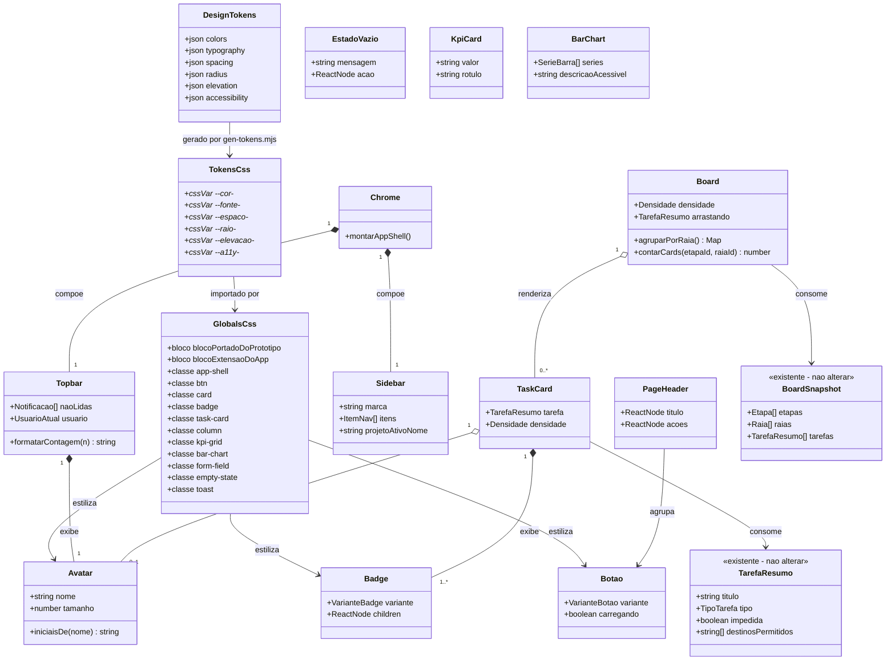

# Alinhamento do Frontend ao Design System Normativo (TL-01..TL-10)

## Requirements

Corrigir a camada de apresentação do frontend Next.js do Kanban de Tarefas para que o resultado renderizado corresponda ao protótipo normativo em `requirements/design/kanban-tarefas/prototypes/`, eliminando a divergência visual percebida ("não ficou igual") sem alterar comportamento de negócio.

- **Problema essencial**: a lógica (auth, RBAC, streaming, chamadas de API, regras RF/RN) está correta, mas a apresentação divergiu do design em quatro eixos — tipografia não carregada, estrutura de shell diferente, vocabulário de classes paralelo e componentes visuais ausentes.
- **Valor**: entregar ao usuário/stakeholder a interface que foi aprovada no protótipo, tornando a fidelidade auditável por comparação direta tela-a-tela.
- **Escopo**: exclusivamente `frontend/` — CSS global, componentes React e marcação. Desktop, breakpoints 1280px (prioritário) e 1024px (secundário), pt_BR, WCAG AA.
- **Fora de escopo**: backend, contratos de API, esquema de banco, lógica de permissões, protocolo de streaming, novos endpoints, testes automatizados de frontend (não existe runner no projeto).
- **Critério de aceite**: paridade estrutural e visual com os HTMLs de referência em 1280px, tela a tela, sem exigência de pixel-perfect.

---

## Entities

Modelo conceitual da **camada de apresentação**. As entidades de domínio (`TarefaResumo`, `BoardSnapshot`, `Projeto`, `Dashboard`, …) em `src/lib/types.ts` **permanecem intocadas** — nenhum tipo é criado, alterado ou removido. O diagrama abaixo modela apenas os componentes de UI e o token pipeline.



**Restrições conservadoras aplicadas**:

- Nenhum tipo de `src/lib/types.ts` é criado, estendido ou renomeado.
- `Avatar`, `Badge`, `Botao`, `PageHeader`, `EstadoVazio`, `KpiCard`, `BarChart` são componentes de apresentação **sem estado** e **sem acesso a API** — recebem tudo por prop.
- As abstrações existentes de `Estados.tsx` (`Skeleton`, `Vazio`, `Erro`, `SemPermissao`, `AvisoSomenteLeitura`) e `Feedback.tsx` (`FeedbackProvider`, `useFeedback`) são **mantidas**; apenas sua marcação e classes mudam.
- O pipeline `design-tokens.json → gen-tokens.mjs → tokens.css` **não é alterado** — está correto.

---

## Approach

### 1. Fundação visual (CSS e tipografia)

- **Fonte Inter via `next/font/google`**, exposta como variável CSS no `<html>` e encadeada com o token existente como fallback (`font-family: var(--font-inter), var(--fonte-font-family-base)`). O `Dockerfile` já executa `npm ci` com rede na mesma etapa de build, então o download em build-time do `next/font` é viável; o fallback do token garante degradação graciosa.
- **`globals.css` reescrito em dois blocos demarcados por comentário**:
  - `/* === BLOCO PORTADO DE _shared.css — paridade com o protótipo === */` — cópia fiel de `prototypes/_shared.css`, com os literais de cor/espaço substituídos pelos tokens `--cor-*`/`--espaco-*`/`--raio-*` equivalentes.
  - `/* === BLOCO DE EXTENSÃO DO APP — não existe no protótipo === */` — drawer lateral fixo, pilha de toasts, backdrop de modal, animação de skeleton, `prefers-reduced-motion`, e os estados de RBAC (`SemPermissao`, `AvisoSomenteLeitura`) que o protótipo não cobre.
- **Elevação**: `_shared.css` não define sombras, mas `design-tokens.json` sim. Em conflito entre as duas fontes, **o JSON prevalece** — `--elevacao-card/modal/dropdown` continuam aplicados.
- **Erradicar literais**: `#fff3cd`/`#8a6d3b`, `#eceff1`/`#f5f7f8`, `rgba(33,37,41,0.4)` e todo `style={{ gap: 8, marginBottom: 24, … }}` que carregue valor de token viram `var(--*)` ou classe.

### 2. Shell da aplicação

- Substituir `.layout` (grid de 2 colunas) por `.app-shell` com `grid-template-areas: "sidebar topbar" / "sidebar main"`, colunas `240px 1fr`, linhas `56px 1fr`.
- `Sidebar`: `.sidebar__brand`, `<nav>` com links e `aria-current="page"`, `.sidebar__project-active` fixado ao rodapé via `margin-top: auto`.
- `Topbar`: `.topbar__notif` (sino + `.topbar__notif-badge` com contagem truncada) e `.topbar__user` (avatar de iniciais + nome + sair), alinhados à direita. O dropdown ganha ancestral `position: relative`, corrigindo o posicionamento quebrado atual.
- **Remover** o `@media (max-width: 1024px) { .sidebar { display: none } }` — 1024px é breakpoint suportado.

### 3. Convergência tela a tela

Percorrer TL-01 → TL-10 na ordem, alinhando cada tela ao seu HTML de referência em estrutura, composição, hierarquia tipográfica e estados da matriz da seção 6 do brief.

- **Renomeação de vocabulário** (mapa canônico, aplicado globalmente): `.cartao`→`.card`, `.conteudo`→`.main`, `.coluna`→`.column`, `.card` (tarefa)→`.task-card`, `.card.impedida`→`.task-card__impedido`, `.vazio`→`.empty-state`, `.tabela`→`table` (estilo por elemento), `.barra`→`.bar`, `.abas`→`.tabs`, `.lista-cartoes`→`.project-grid`, `.raia-titulo`→`.swimlane__title`, `.erro-inline`→`.form-error`, `.toast.erro`→`.toast.toast-error`, `button.primario`→`.btn.btn-primary`, `button.perigo`→`.btn.btn-danger`.
- **Board**: inverter a hierarquia para **raia externa (`.swimlane`) contendo `.board` com as `.column`**. Cada coluna ganha contador de cards no header. O `raiaDestinoId` do drop passa a ser a raia da swimlane de destino — contrato já suportado ponta a ponta por `api.moverTarefa`.
- **Feedback de drag**: `.column--drop-valid` (outline verde tracejado + tint) e `.column--drop-invalid` (opacidade), mais `.badge-transicao--ok` ("Permitido") / `--bloqueada` ("Sem transição") no header, conforme o protótipo. A fonte de verdade continua sendo `tarefa.destinosPermitidos` — nada é derivado da raia.
- **Erro de transição bloqueada**: passa de toast informativo para `role="alert" aria-live="assertive"`, renderizado **inline acima do board** (não no canto fixo), garantindo visibilidade durante scroll horizontal.
- **Dashboard**: adotar `.kpi-grid` + `.bar-chart` vertical do protótipo, mantendo a tabela detalhada abaixo. Filtro de período vira `<select>` com presets ("Últimos 30 dias" / "Últimos 90 dias"), convertidos no par `inicio`/`fim` ISO já aceito por `api.dashboard`.
- **Acentuação**: toda string visível da UI passa a pt_BR acentuado.

### 4. Regra de honestidade de dados (crítica)

O protótipo exibe dados que **a API não fornece**. Em nenhuma hipótese esses valores devem ser inventados, estimados ou preenchidos com placeholder:

| Elemento do protótipo | Campo na API | Decisão |
|---|---|---|
| TL-02: "12 tarefas ativas · 3 impedidas" | `Projeto` não tem contadores | Usar `descricao` na linha `.text-secondary`; omitir a linha se ausente |
| TL-07: KPI "Tarefas concluídas no período" | `Dashboard` não tem o campo | Renderizar apenas os 2 KPIs derivávies (`impedimentoMedioTotalSegundos`, etapas com medição) no `.kpi-grid` |
| TL-03b: "Lead-time: 2d 4h" no card | `TarefaResumo` não tem lead-time (só `TarefaDetalhe`) | Omitir do card; a `meta-row` exibe responsável/impedimento e prioridade |

### 5. Riscos e mitigações

- **Regressão silenciosa na renomeação** (classe órfã não estiliza e não quebra build): mitigar com varredura final por `grep` das classes antigas em `src/`, exigindo zero ocorrências.
- **Inversão raia/coluna quebrar RF-002/RN-003**: mitigar preservando `destinosPermitidos` como única autoridade do drop.
- **Ausência de testes de frontend**: mitigar com verificação manual guiada pela matriz de estados, e `npm run typecheck` + `npm run lint` limpos como portão mínimo.

---

## Structure

### Inheritance Relationships

1. `globals.css` importa `tokens.css` (gerado) — relação de derivação, nunca de edição manual.
2. `Avatar`, `Badge`, `Botao`, `PageHeader`, `EstadoVazio`, `KpiCard`, `BarChart` são componentes funcionais React puros, sem herança de classe.
3. `Chrome` compõe `Sidebar` e `Topbar` (composição, não herança).
4. `Board` compõe `Swimlane` → `Column` → `TaskCard` (composição hierárquica).
5. `Estados.tsx` e `Feedback.tsx` mantêm as assinaturas públicas atuais — nenhuma quebra de contrato para os consumidores.

### Dependencies

1. `app/layout.tsx` depende de `next/font/google` (Inter) e de `FeedbackProvider`.
2. `app/projetos/layout.tsx` depende de `Chrome`.
3. `Chrome` depende de `Sidebar`, `Topbar`, `next/navigation` (`useParams`, `usePathname`).
4. `Topbar` depende de `Avatar`, `api.eu()`, `api.notificacoes()`, `sair()`.
5. `Board` depende de `TaskCard`, `CardMenu`, `EstadoVazio`, `BoardSnapshot`.
6. `TaskCard` depende de `Badge` e `Avatar`.
7. `Dashboard` depende de `KpiCard`, `BarChart`, `Estados`, `api.dashboard()`.
8. Todas as telas dependem do vocabulário de classes de `globals.css`.
9. **Nenhum componente novo acessa `api` diretamente** — apresentação pura.

### Layered Architecture

1. **Camada de tokens**: `design-tokens.json` → `scripts/gen-tokens.mjs` → `src/styles/tokens.css`. Fonte única de verdade para valores visuais. Somente leitura para todo o resto.
2. **Camada de folha de estilo**: `src/styles/globals.css`. Traduz tokens em vocabulário de classes idêntico ao do protótipo. Bloco portado + bloco de extensão.
3. **Camada de átomos de UI**: `src/components/ui/*`. Componentes sem estado, sem I/O, sem regra de negócio.
4. **Camada de chrome**: `src/components/Chrome.tsx` (+ `Sidebar`, `Topbar`). Estrutura persistente entre rotas.
5. **Camada de tela/feature**: componentes e páginas existentes (`Board`, `Dashboard`, `TarefaDrawer`, `NovaTarefaModal`, `ConfirmarExclusaoModal`, páginas de `app/`). Lógica preservada, marcação substituída.
6. **Camada de feedback transversal**: `Feedback.tsx` — toasts e modal bloqueante, agora no vocabulário `.toast-error`/`.toast-success`.

---

## Operations

### 1. Configurar tipografia Inter — `src/app/layout.tsx`

1. Responsabilidade: carregar a fonte Inter e expô-la como variável CSS no documento.
2. Implementação:
   - Importar `import { Inter } from 'next/font/google'`.
   - Instanciar: `const inter = Inter({ subsets: ['latin'], display: 'swap', variable: '--font-inter' })`.
   - Aplicar no elemento raiz: `<html lang="pt-BR" className={inter.variable}>`.
3. Restrições:
   - Não alterar `tokens.css` (arquivo gerado).
   - Não remover o script de configuração pública inline nem `export const dynamic = 'force-dynamic'`.
   - O fallback do token (`system-ui, -apple-system, sans-serif`) deve permanecer na cadeia.

### 2. Reescrever a folha global — `src/styles/globals.css`

1. Responsabilidade: ser a tradução fiel de `_shared.css` em cima dos tokens, mais as extensões que o app real exige.
2. Estrutura obrigatória do arquivo, nesta ordem:
   - `@import './tokens.css';`
   - Regra de família tipográfica: `html, body { font-family: var(--font-inter), var(--fonte-font-family-base); }`
   - `/* === BLOCO PORTADO DE _shared.css === */`
   - `/* === BLOCO DE EXTENSÃO DO APP === */`
3. Classes obrigatórias do bloco portado (paridade 1:1 com `_shared.css`, literais trocados por tokens):
   - Layout: `.app-shell`, `.sidebar`, `.sidebar__brand`, `.sidebar nav a`, `.sidebar nav a[aria-current="page"]`, `.sidebar__project-active`, `.topbar`, `.topbar__notif`, `.topbar__notif-badge`, `.topbar__user`, `.main`, `.page-header`
   - Átomos: `.avatar`, `.btn`, `.btn-primary`, `.btn-secondary`, `.btn-outline`, `.btn-danger`, `.btn-text`, `.card`, `.badge`, `.badge-tipo`, `.badge-warning`, `.badge-error`, `.badge-success`, `.text-secondary`, `.skeleton`, `.empty-state`
   - Board: `.board`, `.column`, `.column__header`, `.task-card`, `.task-card__impedido`, `.column--drop-valid`, `.column--drop-invalid`, `.badge-transicao`, `.badge-transicao--ok`, `.badge-transicao--bloqueada`, `.swimlane`, `.swimlane__title`
   - Formulário e feedback: `.form-field`, `.form-error`, `.toast`, `.toast-error`, `.toast-success`, `.modal-overlay`, `.modal`
   - Tabela: `table`, `th`, `td` (estilo por elemento, como no protótipo), `.toggle`
   - Dashboard: `.kpi-grid`, `.kpi-card`, `.kpi-value`, `.kpi-label`, `.bar-chart`, `.bar`, `.bar-wrap`
   - Complementos: `.project-grid`, `.tabs`, `.tabs [role="tab"][aria-selected="true"]`
4. Classes obrigatórias do bloco de extensão (não existem no protótipo):
   - `.drawer` (painel lateral fixo, 480px, `border-left`, scroll próprio, `--elevacao-modal`)
   - `.toasts` (pilha fixa) — usada apenas para avisos globais; o erro de transição do board é inline
   - `.backdrop` (overlay de modal com `rgba` derivado de `--cor-text-primary`)
   - `.skeleton` com `@keyframes brilho` e `@media (prefers-reduced-motion: reduce)`
   - `.aviso-somente-leitura`, `.sem-permissao` (estados de RBAC)
   - `.field-locked` (campo travado pós-início, TL-04)
   - `.history-item` (item do histórico de auditoria, TL-04)
   - `.modal-actions` (rodapé de ações alinhado à direita, TL-06)
5. Regras específicas com valor normativo:
   - `.task-card` **não** tem borda esquerda. Só `.task-card__impedido` tem: `border-left: 4px solid var(--cor-warning)`.
   - `.column--drop-valid`: `outline: 2px dashed var(--cor-success); outline-offset: -2px;` mais tint de fundo derivado de success.
   - `.column--drop-invalid`: `opacity: .45`.
   - `.app-shell`: `grid-template-columns: 240px 1fr; grid-template-rows: 56px 1fr;` com as áreas nomeadas.
   - Guarda contra nomes longos: `.column`, `.card`, `.kpi-card` recebem `min-width: 0`; títulos de card e de coluna recebem `overflow-wrap: anywhere`.
   - `.task-card[draggable="false"] { cursor: default; }`
6. Remover: `.layout`, `.cartao`, `.conteudo`, `.coluna`, `.raia-titulo`, `.tabela`, `.barra`, `.abas`, `.lista-cartoes`, `.vazio`, `.erro-inline`, `button.primario`, `button.perigo`, e a media query que oculta a sidebar em 1024px.

### 3. Criar átomos de UI — `src/components/ui/`

#### 3.1 `Avatar.tsx`
1. Responsabilidade: renderizar círculo com as iniciais de um nome.
2. Props: `nome?: string`, `tamanho?: number` (default 28).
3. Método interno: `iniciaisDe(nome?: string): string`
   - Lógica: se vazio/ausente → `'?'`; separa por espaço, descarta partículas (`de`, `da`, `do`, `dos`, `das`); com 1 token → suas 2 primeiras letras em maiúscula; com ≥2 tokens → primeira letra do primeiro e do último.
4. Marcação: `<span className="avatar" style={{ width: tamanho, height: tamanho }} aria-hidden="true" title={nome}>`.
5. Restrição: `aria-hidden` porque o nome sempre acompanha o avatar em texto adjacente — evita leitura duplicada.

#### 3.2 `Badge.tsx`
1. Props: `variante?: 'tipo' | 'warning' | 'error' | 'success' | 'neutro'` (default `'neutro'`), `children`, `title?`.
2. Lógica: mapeia variante para `badge badge-tipo` / `badge badge-warning` / `badge badge-error` / `badge badge-success` / `badge`.

#### 3.3 `Botao.tsx`
1. Props: estende `ButtonHTMLAttributes<HTMLButtonElement>` com `variante?: 'primary' | 'secondary' | 'outline' | 'danger' | 'text'` (default `'outline'`), `carregando?: boolean`.
2. Lógica: compõe `btn btn-${variante}`; quando `carregando` → `disabled` e `aria-busy="true"`.
3. Restrição: preserva `className` recebida por concatenação, não por substituição.

#### 3.4 `PageHeader.tsx`
1. Props: `titulo: ReactNode`, `subtitulo?: ReactNode`, `acoes?: ReactNode`.
2. Marcação: `<div className="page-header"><h1>{titulo}{subtitulo && <span className="text-secondary">…</span>}</h1><div>{acoes}</div></div>`.

#### 3.5 `KpiCard.tsx`
1. Props: `valor: string`, `rotulo: string`.
2. Marcação: `<div className="card kpi-card"><div className="kpi-value">{valor}</div><div className="kpi-label">{rotulo}</div></div>`.

#### 3.6 `BarChart.tsx`
1. Props: `series: { rotulo: string; valor: number; textoValor: string }[]`, `descricaoAcessivel: string`, `alturaMax?: number` (default 160).
2. Lógica:
   - `maior = Math.max(1, ...series.map(s => s.valor))`
   - altura de cada barra = `Math.round((valor / maior) * alturaMax)`, com mínimo de 2px para valores > 0
   - série com `valor === 0` renderiza barra de 2px — nunca é omitida silenciosamente do eixo
3. Marcação: `<div className="bar-chart" role="img" aria-label={descricaoAcessivel}>` com um `.bar-wrap` por série contendo `.bar` e o rótulo.

#### 3.7 `EstadoVazio.tsx`
1. Props: `mensagem: ReactNode`, `acao?: ReactNode`, `compacto?: boolean`.
2. Marcação: `<div className="empty-state" style={compacto ? { padding: 'var(--espaco-scale-md)' } : undefined}>`.
3. Nota: `Estados.tsx` passa a reexportar `Vazio` como alias fino deste componente, preservando os consumidores atuais.

### 4. Reconstruir o chrome — `src/components/Chrome.tsx`

1. Responsabilidade: montar o `app-shell` e as áreas persistentes.
2. Estrutura de marcação:
   ```
   <div className="app-shell">
     <aside className="sidebar" aria-label="Navegação principal"> … </aside>
     <header className="topbar"> … </header>
     <main className="main">{children}</main>
   </div>
   ```
   As três áreas são **irmãs diretas** do grid — a `<main>` não fica aninhada com a topbar.
3. `Sidebar`:
   - `<div className="sidebar__brand">Kanban</div>`
   - `<nav aria-label="Menu">` com `<Link>` para Projetos, e — quando há `projetoId` — Board, Dashboard, Administração. Cada link recebe `aria-current="page"` quando `usePathname()` corresponde.
   - `<div className="sidebar__project-active">Projeto ativo: {nome}</div>` quando há projeto no contexto. O nome vem de `api.projetos()` (filtrando por `projetoId`) ou é omitido se indisponível — **não inventar rótulo**.
   - Remover o `<ul style={{…}}>` inline; a estilização é `.sidebar nav a`.
4. `Topbar`:
   - Wrapper com `position: relative` para ancorar o dropdown.
   - Sino: `<button className="topbar__notif" aria-label={\`Notificações (${n} não lidas)\`} aria-expanded={aberto}>🔔` mais `<span className="topbar__notif-badge">{formatarContagem(n)}</span>` renderizado **somente se `n > 0`**.
   - `formatarContagem(n: number): string` → `n > 9 ? '9+' : String(n)`.
   - Dropdown: `<ul className="card" aria-live="polite">` posicionado absolutamente sob o sino, com `--elevacao-dropdown`.
   - Usuário: `<div className="topbar__user"><Avatar nome={usuario?.nome} /> {usuario?.nome ?? '—'}</div>` seguido de `<Botao variante="text" onClick={sair}>Sair</Botao>`.
   - Preservar integralmente a lógica atual de `api.eu()`, polling de 30s de `api.notificacoes(true)` e `api.marcarNotificacaoLida`.

### 5. TL-01 Login — `src/app/login/page.tsx`

1. Marcação: `<main>` centralizado; `<div className="card login-card">` com largura 380px e `text-align: center`.
2. Conteúdo: `<h1>Kanban de Tarefas</h1>` (18px via `.login-card h1`), subtítulo `<p className="text-secondary">Autentique-se com sua conta corporativa (Keycloak) para continuar.</p>`.
3. Botão: `<Botao variante="primary" className="full">Entrar com Keycloak</Botao>` com `width: 100%; justify-content: center; padding: 12px 16px`.
4. Estados (preservar a máquina de estados atual `verificando | anonimo | redirecionando | falha`):
   - `verificando`/`redirecionando` → `<p className="text-secondary" role="status" aria-live="polite">` + `.skeleton`
   - `falha` → `<div className="toast toast-error" role="alert">{mensagem}</div>` e o botão permanece disponível
5. Restrição: não alterar `inicializarAuth`, `entrar` nem o redirecionamento para `/projetos`.

### 6. TL-02 Lista de Projetos — `src/app/projetos/page.tsx`

1. Cabeçalho: `<PageHeader titulo="Projetos" acoes={eu?.adminGlobal && <Botao variante="primary">+ Novo projeto</Botao>} />`.
2. Grade: `<section className="project-grid" aria-label="Lista de projetos">`.
3. Card de projeto: o **card inteiro é o link** para o board — `<Link className="card project-card" href={...}>` contendo:
   - `<h3>{projeto.nome}</h3>`
   - `<p className="text-secondary">{projeto.descricao}</p>` — renderizado só se houver descrição. **Não** exibir contadores de tarefas: `Projeto` não os fornece.
   - `<Badge variante={projeto.status === 'ATIVO' ? 'success' : 'neutro'}>{projeto.status === 'ATIVO' ? 'Ativo' : 'Finalizado'}</Badge>`
   - Os links secundários (Dashboard, Administração) saem do card e passam a ser alcançados pela sidebar, como no protótipo.
4. Formulário de criação: campos em `.form-field`, botões `.btn-primary` / `.btn-outline`.
5. Estados: loading → `.skeleton` em grade de 3; erro → `.toast.toast-error` com botão "Tentar novamente"; vazio → `EstadoVazio` com ação "Criar primeiro projeto" (apenas para `adminGlobal`).

### 7. TL-03/03b Board — `src/components/Board.tsx`

1. Responsabilidade: renderizar raias como containers externos, cada uma com seu conjunto de colunas.
2. Estrutura de marcação (inversão da hierarquia atual):
   ```
   {raiasVisiveis.map(raia =>
     <section className="swimlane" key={raia.id} aria-label={`Raia ${raia.nome}`}>
       <div className="swimlane__title">Raia: {raia.nome}</div>
       <div className="board">
         {snapshot.etapas.map(etapa => <Column … />)}
       </div>
     </section>
   )}
   ```
3. `raiasVisiveis`: todas as raias de `snapshot.raias`, ordenadas por `ordem`. Uma raia sem nenhum card em nenhuma etapa **ainda é renderizada** com colunas vazias (o protótipo mostra esse estado explicitamente).
4. Column — marcação e comportamento:
   - `<div className={classe} aria-label={\`Coluna ${etapa.nome}\`}>`
   - Header: `<div className="column__header"><span>{etapa.nome}</span>{indicador}</div>`
     - Sem drag em andamento → `indicador` = `<Badge variante="neutro">{cards.length}</Badge>`
     - Com drag em andamento → `indicador` = `<span className="badge-transicao badge-transicao--ok">Permitido</span>` ou `<span className="badge-transicao badge-transicao--bloqueada">Sem transição</span>`
   - Classe: `column` + (`column--drop-valid` se `arrastando.destinosPermitidos.includes(etapa.id)`, senão `column--drop-invalid`) — aplicadas **somente** enquanto `arrastando !== null`.
   - Coluna sem cards → `<EstadoVazio compacto mensagem="Sem tarefas nesta etapa" />`.
   - Botão de criação por coluna: `<Botao variante="text">+ Novo card</Botao>`, oculto em somente-leitura.
5. Drop handler:
   - `onDragOver`: `preventDefault()` apenas se a etapa está em `destinosPermitidos`.
   - `onDrop`: se a etapa **não** está em `destinosPermitidos` → chamar `aoDropInvalido()` e retornar; senão → `aoMover(tarefa, etapa.id, raia.id)`, passando a raia da swimlane de destino (contrato `raiaDestinoId` já suportado por `api.moverTarefa`).
   - **Invariante**: `destinosPermitidos` é a única autoridade do drop. Nada é derivado da raia.
6. `TaskCard` (novo subcomponente no mesmo arquivo ou em `src/components/TaskCard.tsx`):
   - Classe: `task-card` + `task-card--expanded` (se densidade expandida) + `task-card__impedido` (se `tarefa.impedida`).
   - Ordem de composição, compacto (TL-03): `<Badge variante="tipo">{rotuloTipo}</Badge>` → título (`<p>`, 14px) → `<Avatar nome={tarefa.responsavelNome} tamanho={20} />` ou `<Badge variante="warning">Impedido</Badge>`.
   - Ordem de composição, expandido (TL-03b): badge de tipo → título (14px, `font-weight: 600`) → `<p className="desc">{descricao curta}</p>` → `.meta-row` com avatar/badge de impedimento à esquerda e `<Badge>{prioridade}</Badge>` à direita. **Não exibir lead-time**: `TarefaResumo` não o fornece.
   - `TarefaResumo` não tem `descricao`; no modo expandido, se não houver texto disponível, o `<p className="desc">` é omitido — não renderizar placeholder.
   - `draggable={!somenteLeitura}`; quando não arrastável, o CSS aplica `cursor: default`.
   - O card inteiro é clicável para abrir o drawer: usar `<button>` que envolve o conteúdo com `border:0;background:none;text-align:left;width:100%`, ou `role="button"` + `tabIndex={0}` + handler de `Enter`/`Space`.
   - Rótulos de tipo e prioridade em pt_BR capitalizado (`FEATURE`→"Feature", `BUG`→"Bug", `TAREFA`→"Tarefa", `MELHORIA`→"Melhoria"; `BAIXA`→"Baixa", `MEDIA`→"Média", `ALTA`→"Alta", `CRITICA`→"Crítica") — mapa de constantes, sem alterar os tipos.
7. Toggle de densidade (decisão do usuário: **manter**):
   - Dois `<Botao variante="outline" aria-pressed={…}>` rotulados "Compacto" e "Expandido", posicionados na `acoes` do `PageHeader` do board.
   - Default: `'compacto'`.
8. Preservar: `CardMenu` (apenas reestilizado com `.form-field`/`.btn`), estado `arrastando`, `somenteLeitura`.

### 8. Erro de transição bloqueada — `src/app/projetos/[id]/board/page.tsx`

1. Responsabilidade: exibir a recusa de transição no contexto do board, de forma assertiva.
2. Implementação:
   - Estado local `erroTransicao: string | null`.
   - `aoDropInvalido` passa a `setErroTransicao('Transição não permitida a partir desta etapa. O card retornou à posição original.')`; a mensagem é limpa por timeout de 7s e a cada novo `dragStart`.
   - Quando a recusa vem do backend (`mover` falha), usar a mensagem retornada pelo servidor — o front não inventa texto de erro.
   - Renderizar acima do `<Board>`: `<div className="toast toast-error" role="alert" aria-live="assertive">{erroTransicao}</div>`.
3. Cabeçalho da página: `<PageHeader titulo={\`Board — ${nomeProjeto}\`} acoes={<><Badge …>{conectado ? 'Tempo real ativo' : 'Reconectando…'}</Badge><Botao variante="primary">+ Novo card</Botao></>} />`.
4. Restrição: não alterar `useBoardStream`, `mover`, `resync` nem `usePermissoes`.

### 9. TL-04 Detalhe da Tarefa — `src/components/TarefaDrawer.tsx`

1. Marcação: `<aside className="drawer" role="dialog" aria-modal="true" aria-labelledby="drawer-title">`.
2. Cabeçalho: `<PageHeader>` com `<h1 id="drawer-title">{tarefa.titulo}</h1>` (18px) e `<Botao variante="text" aria-label="Fechar">✕ Fechar</Botao>`; abaixo, `<Badge variante="tipo">{rotuloTipo}</Badge>`.
3. Todos os campos passam para `.form-field` com `<label htmlFor>` explícito (hoje usam `<label>` envolvente sem `id`).
4. Campo travado pós-início: quando `tarefa.iniciada`, descrição e tipo são renderizados como `<div className="field-locked" aria-readonly="true">` em vez de `<input disabled>`, seguindo o protótipo; a explicação vai em `.text-secondary`.
5. Toggle de impedimento: `.form-field.toggle` com `<label>`, `<input type="checkbox">` e `<span className="text-secondary" id="impedido-desc">` referenciado por `aria-describedby`.
6. Lead-time: manter a tabela existente (`<table>` com estilo por elemento) e o total acumulado.
7. Histórico: cada registro vira `<div className="history-item">` com autor em `<strong>`, descrição da mudança e data em `.text-secondary`.
8. Estado de sucesso: após salvar, exibir `<div className="toast toast-success" role="status" aria-live="polite">Alterações salvas com sucesso.</div>` dentro do drawer, além do toast global existente.
9. Rodapé: `<Botao variante="primary">Salvar</Botao>`, `<Botao variante="outline">Observar</Botao>`, `<Botao variante="danger">Excluir</Botao>`.
10. Restrição: preservar integralmente `salvar`, `alternarImpedimento`, paginação de histórico, `observar`/`desobservar` e a trava `camposEstruturaisTravados`.

### 10. TL-05 Nova Tarefa — `src/components/NovaTarefaModal.tsx`

1. Marcação: `<div className="modal-overlay">` → `<div className="modal" role="dialog" aria-modal="true" aria-labelledby="modal-title">`.
2. Cabeçalho: `<PageHeader>` com `<h1 id="modal-title">Novo card</h1>` e `<Botao variante="text" aria-label="Fechar">✕</Botao>`.
3. Campos em `.form-field` com `<label htmlFor>`: Título (obrigatório, `aria-required="true"`, placeholder do protótipo), Descrição, Tipo, Raia (opcional), Responsável (opcional).
4. Erro de validação por campo: `aria-invalid="true"` no input, `aria-describedby` apontando para `<span className="form-error" role="alert">{mensagem}</span>`.
5. Submissão: `<Botao variante="primary" type="submit" carregando={salvando} style={{ width:'100%', justifyContent:'center' }}>{salvando ? 'Criando…' : 'Criar card'}</Botao>`.
6. Restrição: preservar o mapeamento de `ApiError.campos` para `erros`, e a submissão via `api.criarTarefa`.

### 11. TL-06 Confirmação de Exclusão — `src/components/ConfirmarExclusaoModal.tsx`

1. Marcação: `<div className="modal-overlay">` → `<div className="modal" role="alertdialog" aria-modal="true" aria-labelledby="modal-title" aria-describedby="modal-desc">`.
2. Conteúdo: `<h1 id="modal-title">Excluir card</h1>`, `<p id="modal-desc">Tem certeza de que deseja excluir o card <strong>"{titulo}"</strong>? {impacto}</p>`.
3. Ações: `<div className="modal-actions">` com `<Botao variante="outline">Cancelar</Botao>` e `<Botao variante="danger" carregando={executando}>{executando ? 'Excluindo…' : 'Excluir'}</Botao>`, alinhados à direita.
4. Erro de permissão: `<div className="toast toast-error" role="alert">{erro}</div>` **dentro** do modal, acima das ações; o botão Excluir fica desabilitado após a recusa.
5. Restrição: manter a política atual — a tentativa vai ao backend e a recusa é exibida aqui; **não** esconder o botão com base em permissão da UI.

### 12. TL-07 Dashboard — `src/components/Dashboard.tsx`

1. Filtro de período (decisão do usuário: **presets do protótipo**):
   - Substituir os dois `<input type="datetime-local">` por `<select aria-label="Filtro de período">` com opções `30` ("Últimos 30 dias") e `90` ("Últimos 90 dias"); default `30`.
   - `periodoParaIntervalo(dias: number): { inicio: string; fim: string }` → `fim = new Date()`, `inicio = fim - dias * 24h`, ambos em ISO. Alimenta `api.dashboard(projetoId, inicio, fim)`.
   - Recarregar automaticamente ao trocar a opção — sem botão "Aplicar".
   - O `<select>` vai na área de ações do `PageHeader` da página.
2. KPIs: `<div className="kpi-grid">` com **dois** `KpiCard` derivados dos dados reais:
   - `{ valor: `${horas(dados.impedimentoMedioTotalSegundos)} h`, rotulo: 'Tempo médio de impedimento' }`
   - `{ valor: `${comAmostras.length} / ${dados.etapas.length}`, rotulo: 'Etapas com medição' }`
   - **Não** renderizar "Tarefas concluídas no período" — `Dashboard` não expõe o campo.
3. Gráfico: `<div className="card">` com `<h2>Lead-time médio por etapa</h2>` e `<BarChart>` alimentado por `comAmostras`, ordenado por `ordem`:
   - `series = comAmostras.map(e => ({ rotulo: e.etapaNome, valor: e.mediaPermanenciaSegundos, textoValor: `${horas(...)} h` }))`
   - `descricaoAcessivel` = enumeração textual de etapa e valor.
4. Tabela detalhada mantida abaixo do gráfico, agora com `<table>` sem classe (estilo por elemento) e `<caption>` preservado. Etapa com `amostras === 0` continua exibindo `<Badge>sem dados</Badge>` em vez de barra.
5. Estados: loading → `.skeleton` na grade de KPIs; erro → `.toast.toast-error` com botão "Tentar novamente"; vazio → `EstadoVazio` com "Ainda não há movimentações suficientes para calcular lead-time neste projeto."
6. Restrição: preservar `horas()`, a regra "etapa sem amostras não vira barra" e o tratamento de erro atual.

### 13. TL-08 Admin de Projeto — `src/app/projetos/[id]/admin/page.tsx` e `layout.tsx`

1. `layout.tsx`:
   - Substituir `<h1>Administração do projeto</h1>` + `.abas` por `<PageHeader titulo="Admin de Projeto" acoes={…} />` seguido de `<div className="tabs" role="tablist" aria-label="Configuração de workflow">`.
   - Os itens de aba mantêm `<Link>` (são rotas), estilizados por `.tabs a[aria-current="page"]`.
   - Rótulos acentuados: "Workflow", "Papéis e toggles", "Usuários".
2. `page.tsx`:
   - Cada bloco (`Workflows`, `Colunas`, `Transições`, `Raias`) passa de `<section className="cartao">` para `<section>` com `<h2>` e `<table>` no padrão do protótipo.
   - Botões: `.btn-outline` para ações neutras, `.btn-primary` para "Adicionar", `.btn-text` para "Editar"/"Excluir" em linha de tabela.
   - Formulários inline passam a `.form-field` agrupados horizontalmente por uma classe utilitária do bloco de extensão (`.form-row`).
   - Avisos inline (`avisoInline`, `semSaida`) passam de `<p className="erro-inline">` para `<div className="toast toast-error" role="alert">` e `<div className="toast toast-success" role="status">` conforme a severidade.
   - Estado vazio de workflows: `<EstadoVazio mensagem="Este projeto ainda não possui workflow configurado." acao={<Botao variante="primary">Criar workflow</Botao>} />`.
   - Toda a lógica de `executar`, `carregar`, `carregarGrafo`, reordenação de etapas e o tratamento especial de `WORKFLOW_INVALIDO` / `RECURSO_POSSUI_TAREFAS_ATIVAS` é **preservada sem alteração**.
3. Acentuação: "Situação", "Ações", "Transições", "Raias", "Padrão", "Não", "Configuração", "administração".

### 14. TL-09 Papéis e Permissões — `src/app/projetos/[id]/admin/papeis/page.tsx`

1. `<PageHeader titulo="Papéis e Permissões" />`.
2. Matriz papel × permissão: `<table>` sem classe; célula marcada usa `<Badge variante="success">●</Badge>` ou o caractere atual, mantendo o `aria-label` "sim"/"não" já presente.
3. Toggles do projeto: cada um vira `.form-field.toggle` com `<label htmlFor>`, `<input type="checkbox">` e `<span className="text-secondary" id="…-desc">` ligado por `aria-describedby`, usando os rótulos de `ROTULO_TOGGLE`.
4. Sucesso: `<div className="toast toast-success" role="status" aria-live="polite">Permissões atualizadas com sucesso.</div>`.
5. Restrição: a matriz continua **somente leitura nesta entrega**, apesar de o protótipo desenhar checkboxes editáveis. Motivo: o backend não expõe endpoint de escrita para permissões de papel — `AdminPapelController` tem apenas `GET /api/projetos/{id}/papeis`, servindo um catálogo estático de `listarPapeis()`. Habilitar a edição para admin global exige um endpoint novo, fora do escopo desta correção de frontend.
6. Corrigir o texto explicativo, que hoje afirma incorretamente que o catálogo não é editável por ninguém. Novo texto: "O catálogo de papéis e permissões é fixo para os papéis do projeto, inclusive para o administrador do projeto. Alterações no catálogo são privilégio do administrador global e ainda não estão disponíveis nesta tela." Renderizar em `.text-secondary`.
7. Restrição: preservar o salvamento otimista com rollback dos toggles.

### 15. TL-10 Lista de Usuários — `src/app/projetos/[id]/admin/usuarios/page.tsx`

1. `<PageHeader titulo="Usuários do Projeto" acoes={<Botao variante="primary">+ Associar usuário</Botao>} />`.
2. Tabela de membros: coluna "Usuário" com `<Avatar nome={membro.nome} tamanho={22} /> {membro.nome}`, coluna de e-mail, coluna de papéis com `<Badge>` por papel e botão de remoção `.btn-text` (só para papéis não protegidos e projeto ativo).
3. Estado vazio: `<EstadoVazio mensagem="Nenhum usuário associado a este projeto ainda." acao={<Botao variante="primary">Associar usuário</Botao>} />`.
4. Formulário de associação em `.form-field` horizontais com `<label htmlFor>` explícitos.
5. Restrição: preservar `delegaveis` (papéis protegidos fora da lista) e o comportamento de `associar`/`desassociar`.

### 16. Ajustar estados compartilhados — `src/components/Estados.tsx` e `Feedback.tsx`

1. `Estados.tsx` — manter todas as assinaturas públicas; trocar apenas marcação:
   - `Vazio` → delega para `EstadoVazio`.
   - `Erro` → `<div className="toast toast-error" role="alert">{mensagem} <Botao variante="outline">Tentar novamente</Botao></div>`.
   - `SemPermissao` → `<div className="empty-state" role="alert">Você não tem permissão para visualizar este conteúdo.</div>`.
   - `AvisoSomenteLeitura` → `<div className="toast" role="status">Projeto finalizado: o conteúdo está em modo somente leitura para todos os papéis.</div>`.
   - `Skeleton` → mantém `aria-busy`/`aria-label`, agora com `gap` via `var(--espaco-scale-sm)`.
2. `Feedback.tsx`:
   - Toast informativo → `toast toast-success`; toast de erro → `toast toast-error`.
   - Modal bloqueante → `.modal-overlay` + `.modal` + `.modal-actions`, com `<Botao variante="primary">Entendi</Botao>`.
   - Textos acentuados: "Ação não concluída", "Ocorreu um erro inesperado."
   - Preservar `informar`, `reportar`, `exigeModal`, os timeouts de 5s/7s e a regra de exibir a mensagem do backend sem reescrevê-la.

### 17. Varredura final de conformidade

1. Buscar em `src/` por todas as classes removidas (`cartao`, `conteudo`, `coluna`, `raia-titulo`, `tabela`, `barra`, `abas`, `lista-cartoes`, `vazio`, `erro-inline`, `primario`, `perigo`, `impedida`) — resultado esperado: **zero ocorrências**.
2. Buscar por `style={{` em `src/` — cada ocorrência remanescente deve ser justificável (valor dinâmico calculado, como altura de barra ou dimensão de avatar); nenhuma pode conter valor de token literal.
3. Buscar por literais de cor hexadecimal e `rgba(` em `src/` fora de `tokens.css` — resultado esperado: **zero ocorrências**.
4. Executar `npm run typecheck` e `npm run lint` — ambos devem passar limpos.
5. Executar `npm run tokens` e confirmar que `tokens.css` não sofreu alteração (o pipeline é idempotente e não foi tocado).
6. Verificação visual em 1280px e 1024px, tela a tela, contra o HTML de referência correspondente.

---

## Norms

1. **Tokens como fonte única**: nenhum valor de cor, espaçamento, raio, elevação ou tamanho de fonte pode aparecer literal em componente ou em `globals.css` fora do `@import`. Sempre `var(--cor-*)`, `var(--espaco-scale-*)`, `var(--raio-*)`, `var(--elevacao-*)`, `var(--fonte-scale-*)`.
2. **Arquivo gerado é imutável**: `src/styles/tokens.css` nunca é editado à mão. Qualquer mudança de valor entra em `frontend/design-tokens.json` e é regenerada por `npm run tokens`.
3. **Nomenclatura de classes**: idêntica à de `prototypes/_shared.css`, em inglês e kebab-case, com BEM onde o protótipo usa (`bloco__elemento`, `bloco--modificador`). Não introduzir nomes em português na camada de CSS.
4. **Nomenclatura de código**: componentes, props, variáveis e comentários seguem o padrão vigente do projeto — português, `camelCase` para variáveis e `PascalCase` para componentes. O contraste com o CSS em inglês é intencional: o CSS espelha o protótipo, o TypeScript espelha o domínio.
5. **Textos de UI**: pt_BR **com acentuação correta**, sem exceção. Isso inclui `aria-label`, `title`, `placeholder` e mensagens.
6. **Componentes de apresentação**: sem estado, sem `useEffect`, sem chamada de API, sem regra de negócio. Recebem tudo por prop e retornam marcação.
7. **Estilo inline**: proibido para qualquer valor que exista como token. Permitido apenas para valores computados em tempo de execução (altura de barra, dimensão de avatar, largura percentual).
8. **Acessibilidade**:
   - Todo `<input>`, `<select>` e `<textarea>` tem `<label htmlFor>` associado ou `aria-label`.
   - Erro de campo: `aria-invalid="true"` no controle + `aria-describedby` apontando para `.form-error` com `role="alert"`.
   - Diálogos: `role="dialog"` ou `role="alertdialog"`, `aria-modal="true"`, `aria-labelledby` e — quando há corpo descritivo — `aria-describedby`.
   - Notificações em tempo real: `aria-live="polite"`. Erros que exigem reação imediata (transição bloqueada): `role="alert"` + `aria-live="assertive"`.
   - Foco visível preservado em todos os interativos via `:focus-visible` com os tokens de a11y.
   - Ícones decorativos (emoji do sino, avatar) marcados com `aria-hidden="true"`, com o significado transportado por texto ou `aria-label` adjacente.
9. **Tratamento de erro**: a mensagem exibida é sempre a que o backend retornou. O frontend só produz texto próprio quando não há resposta do servidor (falha de rede, drop rejeitado localmente).
10. **Comentários**: manter os comentários de rastreabilidade existentes (`/** TL-0X. … (RF-00X / DDR-00X) */`) e atualizá-los quando a marcação mudar. Densidade de comentários igual à do código atual — explicar o "porquê", não o "o quê".
11. **Preservação de lógica**: qualquer alteração que toque em `api.*`, `usePermissoes`, `useBoardStream`, `auth.*` ou nas máquinas de estado existentes está fora do escopo e deve ser rejeitada na revisão.

---

## Safeguards

1. **Restrições funcionais**
   - Nenhum comportamento de negócio pode mudar: mesma sequência de chamadas de API, mesmos payloads, mesmas transições de estado.
   - Todas as 11 telas (TL-01..TL-10, incluindo TL-03b) permanecem alcançáveis pelas mesmas rotas.
   - O toggle de densidade do board é mantido, com `compacto` como padrão.
   - O filtro de período do dashboard usa presets de 30/90 dias, convertidos no par `inicio`/`fim` já aceito pela API.

2. **Restrições de dados (crítica)**
   - É **proibido** inventar, estimar ou preencher com placeholder qualquer valor que a API não forneça.
   - Especificamente: contadores de tarefas por projeto (TL-02), KPI "tarefas concluídas no período" (TL-07) e lead-time no card do board (TL-03b) **não são renderizados**, porque `Projeto`, `Dashboard` e `TarefaResumo` não os expõem.
   - Nenhum tipo em `src/lib/types.ts` é criado, alterado ou removido.
   - Nenhuma chamada de API nova é introduzida.

3. **Restrições técnicas**
   - Escopo limitado a `frontend/src/**`, `frontend/src/app/layout.tsx` e `frontend/package.json` (apenas se `next/font` exigir). `backend/`, `infra/`, `docker-compose.yml` e as migrations não são tocados.
   - `frontend/design-tokens.json` e `scripts/gen-tokens.mjs` permanecem inalterados.
   - `src/styles/tokens.css` deve ser byte-idêntico antes e depois da mudança.
   - `next.config.mjs` permanece com `output: 'standalone'` — a mudança não pode quebrar o build Docker.

4. **Restrições de integração**
   - `useBoardStream`, `usePermissoes`, `lib/api.ts`, `lib/auth.ts`, `lib/stomp.ts` e `lib/config.ts` são intocados.
   - As assinaturas públicas de `Estados.tsx` e `Feedback.tsx` são preservadas — nenhum consumidor precisa mudar por causa delas.
   - `api.moverTarefa` já aceita `raiaDestinoId`; a passagem da raia de destino usa o contrato existente, sem alteração de backend.

5. **Restrições de regra de negócio**
   - RF-002/RN-003: o destino válido de drop é determinado **exclusivamente** por `tarefa.destinosPermitidos`. A raia é agrupamento visual e nunca restringe o drop.
   - RF-003: a trava de edição pós-início (`tarefa.iniciada`) continua espelhando a regra do backend.
   - RF-004: o indicador de impedimento é a borda esquerda de 4px em `--cor-warning` mais o badge "Impedido" — nunca aplicado a card não impedido.
   - RF-019: a exclusão sem permissão continua sendo tentada no backend e a recusa exibida dentro do modal; o botão não é escondido preventivamente.
   - BDR-001: o catálogo papel × permissão é fechado para os papéis do projeto, incluindo o administrador de projeto. O administrador global pode editá-lo em princípio, mas **não há endpoint de escrita** — a matriz permanece somente leitura nesta entrega, e a lacuna fica registrada para um trabalho futuro de backend.
   - RN-015: projeto finalizado continua legível em modo somente leitura.

6. **Restrições de acessibilidade (WCAG AA)**
   - Contraste mínimo 4.5:1 para texto — garantido pelos tokens; qualquer combinação nova de cores deve ser verificada.
   - Navegação completa por teclado em todas as telas, incluindo abrir card, arrastar (via `CardMenu` como alternativa acessível ao drag) e fechar diálogos.
   - Foco visível em 100% dos elementos interativos.
   - Nenhum `aria-hidden` em elemento focável.
   - Nenhuma informação transmitida **apenas** por cor: o estado de drop válido/inválido tem o rótulo textual "Permitido"/"Sem transição"; o impedimento tem o badge "Impedido".

7. **Restrições de layout**
   - Breakpoint prioritário 1280px, secundário 1024px. A sidebar permanece visível em ambos.
   - Nenhum comportamento mobile é adicionado; abaixo de 1024px o comportamento é indefinido e aceitável.
   - Colunas do board com `min-width: 280px` e scroll horizontal por swimlane.
   - Nomes longos não podem quebrar o layout: `min-width: 0` em containers de grid/flex e `overflow-wrap: anywhere` em títulos.

8. **Restrições de qualidade verificáveis**
   - Zero ocorrências das classes removidas em `src/`.
   - Zero literais hexadecimais ou `rgba()` em `src/` fora de `tokens.css`.
   - Zero `style={{}}` contendo valor que exista como token.
   - `npm run typecheck` e `npm run lint` passam sem erro.
   - Toda string visível da UI contém acentuação correta quando a ortografia pt_BR a exige.
   - Cada tela TL-01..TL-10 verificada visualmente em 1280px contra seu HTML de referência.

9. **Restrições de escopo**
   - Não adicionar bibliotecas de UI (Bootstrap, Tailwind, shadcn) — conflitaria com DDR-001.
   - Não introduzir CSS Modules, CSS-in-JS ou pré-processadores — o protótipo é CSS puro com classes globais.
   - Não implementar o colapso da sidebar (declarado no brief, ausente do protótipo, escopo indefinido).
   - Não adicionar runner de testes nem testes automatizados — fora do escopo desta correção.
   - Não refatorar a lógica de estado dos componentes além do necessário para trocar a marcação.
